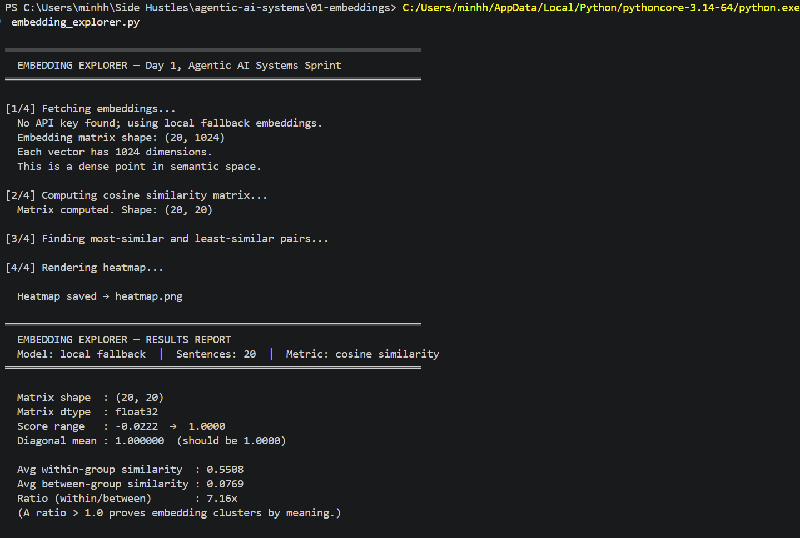
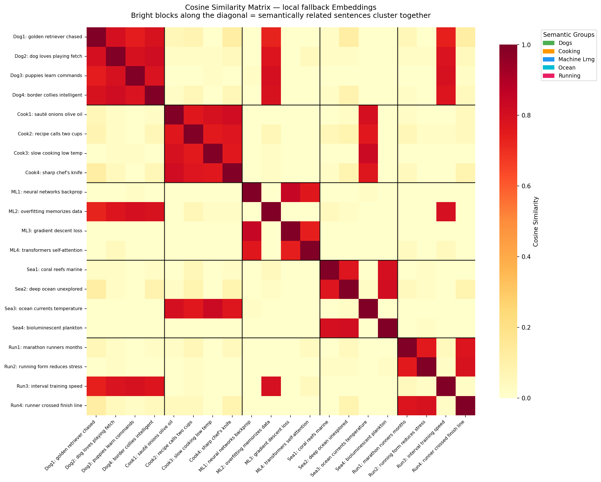

# 01 - Embeddings

## Output





## What this module shows

This folder contains a single executable demo, [embedding_explorer.py](embedding_explorer.py), that turns 20 sentences into vectors, computes pairwise cosine similarity, and draws a heatmap that should form five clear 4x4 blocks on the diagonal.

The script is meant to make the following ideas concrete:

- Embeddings turn text into dense vectors in a shared semantic space.
- Cosine similarity measures angle, not magnitude.
- Sentences about the same topic cluster together.
- The same embedding model and dimensions must be used consistently.
- Dense vectors are mostly non-zero and work differently from sparse, term-based representations.

## What the script does

1. Defines 20 sentences across five topics: dogs, cooking, machine learning, ocean, and running.
2. Embeds all 20 sentences in one batch.
3. Builds a full 20x20 cosine similarity matrix with NumPy.
4. Finds the most-similar and least-similar sentence pairs.
5. Renders a heatmap to `heatmap.png`.
6. Prints a report that checks whether the nearest pairs stay within the same semantic group.

If `VOYAGE_API_KEY` or `ANTHROPIC_API_KEY` is available, the script uses Voyage-3 embeddings at 1024 dimensions.
If no key is available, it falls back to a local deterministic embedding path so the demo still runs and produces the same style of clustering.

## Concepts learned from the code

| Concept | What it means in this demo | Why it matters |
|---------|----------------------------|-----------------|
| Dense embeddings | Each sentence becomes a 1024-dimensional float vector | Meaning is distributed across many dimensions instead of a few keywords |
| One model, one space | All sentences are embedded with the same provider and dimension setting | Similarity scores are only valid inside the same vector space |
| Cosine similarity | Dot product of row-normalized vectors | Measures semantic direction while ignoring vector length |
| High-dimensional geometry | A vector is a point in semantic space, not a single feature | Small angle differences can represent meaning differences |
| Topic clustering | Similar sentences produce darker blocks on the heatmap diagonal | Gives a visual sanity check that the embedding space is coherent |
| Batch inference | All 20 sentences are embedded in one call | Faster and simpler than one request per sentence |
| Query/document roles | The remote path uses `input_type="document"` | Embedding models often behave differently for corpus items and queries |
| Fallback behavior | Local embeddings are used when no API key is configured | The example remains runnable in a clean local environment |

## Code path worth understanding

- [embedding_explorer.py](embedding_explorer.py) defines the sentences and labels.
- [embedding_explorer.py](embedding_explorer.py) embeds the text via `get_embeddings()`.
- [embedding_explorer.py](embedding_explorer.py) computes cosine similarity with `cosine_similarity_matrix()`.
- [embedding_explorer.py](embedding_explorer.py) extracts top and bottom pairs with `find_pairs()`.
- [embedding_explorer.py](embedding_explorer.py) renders the heatmap with `plot_heatmap()`.
- [embedding_explorer.py](embedding_explorer.py) prints the final report with `print_report()`.

## How to run

```powershell
python embedding_explorer.py
```

To use the remote Voyage path instead of the local fallback:

```powershell
$env:VOYAGE_API_KEY="your-key-here"
python embedding_explorer.py
```

## Install

Install the Python dependencies before running the script (recommended in a venv):

```powershell
python -m pip install -r ../requirements.txt
```

Note: the heatmap rendering uses `matplotlib` directly (no `seaborn`/`pandas`),
so the demo runs in constrained environments where some system DLLs may be
restricted.

## What to look for in the output

- The similarity matrix should be 20x20.
- The diagonal should be exactly 1.0.
- Average within-group similarity should be much higher than between-group similarity.
- The top similar pairs should usually stay inside the same semantic group.
- The heatmap should show five bright square blocks along the diagonal.

## Key takeaways

- Embedding quality is visible in geometry.
- Cosine similarity is the right mental model for text embeddings.
- Similarity search only works when chunks and queries share the same embedding space.
- Dense and sparse vectors solve different problems.
- Dimension count matters, but only within the model that generated the vectors.

## References from this module

The README is intentionally aligned to the demo in [embedding_explorer.py](embedding_explorer.py) and the concepts it makes visible:

- Cosine similarity and vector geometry
- Dot product vs L2 distance
- Dense vs sparse vectors
- Same-model constraint for queries and documents
- Embedding dimensions and model-dependent vector length
- Voyage-3 as the remote embedding path used by the script
