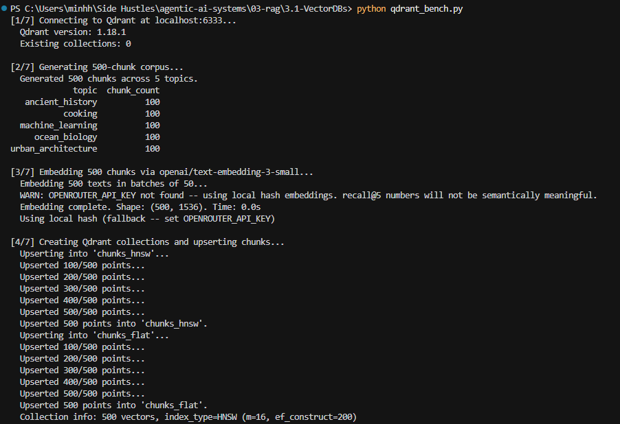
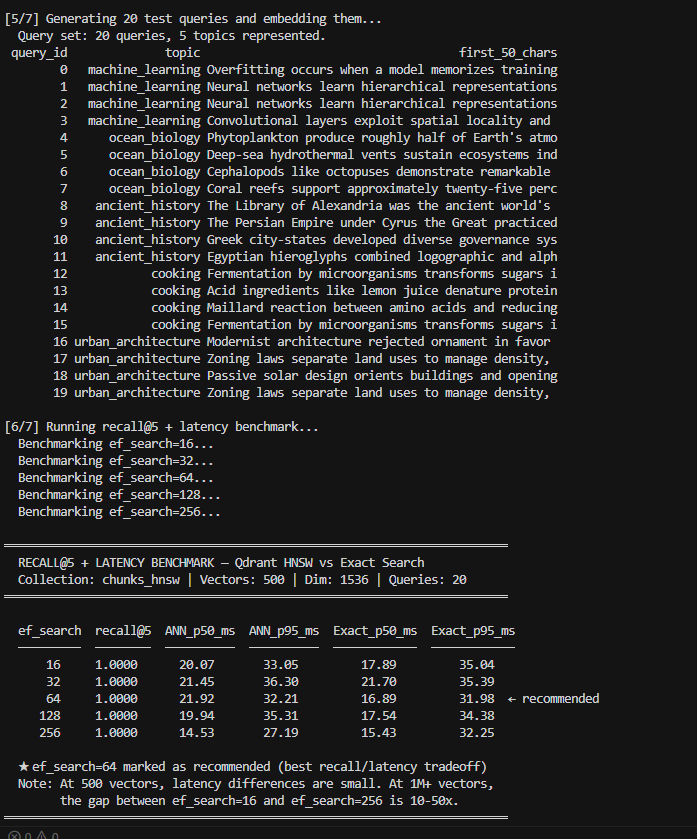
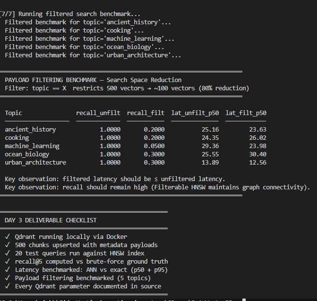

# 03.1 — Vector DBs: Qdrant recall@5 + Latency Benchmark

Day 3 learning module: stand up **local Qdrant**, index a **500-chunk synthetic corpus**, and measure **HNSW (approximate) vs exact (brute-force)** search with **recall@5** and **p50 / p95 latency** across five `ef_search` values, plus a **payload-filtering** pass by topic.

The deliverable is a single CLI (`qdrant_bench.py`) that prints a seven-step pipeline, two annotated tables, and a checklist. Concept answers (Q1–Q5) live in [`DAY3_CONCEPT_ANSWERS.md`](DAY3_CONCEPT_ANSWERS.md).

## What this module shows

| Concept | Where it lives | Why it matters |
|---------|----------------|----------------|
| HNSW graph params (`m`, `ef_construct`, `full_scan_threshold`) | [`src/qdrant_ops.py`](src/qdrant_ops.py) `create_hnsw_collection` | Index quality, RAM, and when Qdrant uses FLAT vs HNSW |
| `ef_search` query knob | [`src/qdrant_ops.py`](src/qdrant_ops.py) `search_hnsw` | Recall ↔ latency dial at query time |
| Exact ground truth | [`src/qdrant_ops.py`](src/qdrant_ops.py) `search_flat` (`exact=True` on HNSW collection) | Denominator for recall@5 |
| FLAT collection (`m=0`) | [`src/qdrant_ops.py`](src/qdrant_ops.py) `create_flat_collection` | Illustrates brute-force index; benchmark ground truth uses `exact=True` on HNSW |
| Payload filtering | [`src/qdrant_ops.py`](src/qdrant_ops.py) `_topic_filter` | Shrinks candidate set (~500 → ~100 per topic) |
| recall@5 formula | [`src/benchmark.py`](src/benchmark.py) `compute_recall_at_k` | Set intersection / k (order-independent) |
| p50 / p95 latency | [`src/benchmark.py`](src/benchmark.py) `_percentiles` | Tail-aware SLAs, not noisy means |

## Results






## Layout

```
03-rag/3.1-VectorDBs/
├── qdrant_bench.py           # CLI entry point (7-step pipeline)
├── requirements.txt
├── pytest.ini
├── conftest.py               # adds module root to sys.path for pytest
├── README.md
├── DAY3_CONCEPT_ANSWERS.md   # Day 3 written Q1–Q5 (system design)
├── .gitignore
├── scripts/
│   └── start_qdrant.sh       # Docker bring-up + healthz wait
├── tests/
│   ├── conftest.py           # Qdrant fixtures; auto-skip if :6333 down
│   ├── test_corpus.py          # offline
│   ├── test_embedder.py        # offline (hash fallback forced)
│   ├── test_benchmark.py       # offline + integration
│   ├── test_qdrant_ops.py      # integration
│   └── test_cli.py             # offline + integration (slow full CLI)
└── src/
    ├── corpus.py             # 500-chunk corpus + 20 stratified queries
    ├── embedder.py           # OpenRouter embeddings + deterministic hash fallback
    ├── qdrant_ops.py         # all Qdrant API calls (inline param comments)
    └── benchmark.py          # recall@5 + latency aggregation
```

**Do not commit:** `.venv/`, `qdrant_storage/`, `benchmark_run.txt`, `test_*.txt`, `.pytest_cache/` (see [`.gitignore`](.gitignore)).

## Prerequisites

- **Python 3.10+** (tested on 3.12)
- **Docker Desktop** (for Qdrant)
- **Optional:** [OpenRouter](https://openrouter.ai/) API key for semantically meaningful recall@5

## Install (Windows)

```powershell
cd "03-rag\3.1-VectorDBs"
python -m venv .venv
.\.venv\Scripts\Activate.ps1
python -m pip install -r requirements.txt
```

Optional `.env` in this directory (loaded by `python-dotenv`):

```text
OPENROUTER_API_KEY=your-openrouter-api-key
```

| Mode | `OPENROUTER_API_KEY` | recall@5 in tables | Use case |
|------|------------------|-------------------|----------|
| **Hash fallback** | unset | Often **1.0** unfiltered at N=500 (ANN ≡ exact); **not** for tuning ef_search | CI plumbing, offline tests, no API cost |
| **OpenRouter semantic embeddings** | set | Meaningful sweep (expect recall to rise with `ef_search`) | Day 3 sign-off, production-like retrieval |

## Start Qdrant (Docker)

From this directory:

```powershell
bash scripts/start_qdrant.sh
```

(`bash` via Git Bash or WSL.) The script:

- Creates `./qdrant_storage` (gitignored) and mounts it for persistence across restarts
- Starts container `qdrant_bench` on REST `:6333` and gRPC `:6334`
- Polls `GET /healthz` for up to 30 seconds

**PowerShell equivalent** (no bash):

```powershell
$storage = (Join-Path (Resolve-Path .).Path "qdrant_storage")
New-Item -ItemType Directory -Force -Path $storage | Out-Null
docker run -d --name qdrant_bench --rm -p 6333:6333 -p 6334:6334 -v "${storage}:/qdrant/storage" qdrant/qdrant:latest
# wait until: curl.exe -sf http://localhost:6333/healthz
```

Stop: `docker stop qdrant_bench` (`--rm` removes the container; data stays in `qdrant_storage/`).

**Health check:**

```powershell
curl.exe -sf http://localhost:6333/healthz
curl.exe -sf http://localhost:6333/collections | python -m json.tool
```

## Run the benchmark

If box-drawing characters show as `?` on Windows, run `chcp 65001` or rely on the CLI’s UTF-8 stdout setup (Python 3.7+).

```powershell
# Full ef_search sweep: {16, 32, 64, 128, 256}
python qdrant_bench.py

# Skip corpus rebuild when both collections already have >= 500 points
python qdrant_bench.py --skip-upsert

# Single ef_search (one table row + faster)
python qdrant_bench.py --ef-only 64
```

Expected CLI output:

1. Step headers `[1/7]` … `[7/7]`
2. Main table: five `ef_search` rows, recall@5, ANN/exact p50 & p95; `★` / `← recommended` at **ef_search=64**
3. Filtered table: five topics (`machine_learning`, `ocean_biology`, `ancient_history`, `cooking`, `urban_architecture`)
4. Seven-item checklist (all `✓`)

Collections created: `chunks_hnsw` (HNSW) and `chunks_flat` (`m=0` illustration). Ground-truth recall uses **`exact=True`** on `chunks_hnsw`.

## Tests

```powershell
# Offline only (no Docker) — 29 tests
python -m pytest tests/ -v -m "not integration"

# Full suite — 47 tests; requires Qdrant on localhost:6333
python -m pytest tests/ -v
```

Integration tests **skip** automatically if Qdrant is unreachable (`tests/conftest.py`). Markers: `integration`, `slow` (full CLI subprocess).

## Parameters cheat-sheet

Defaults are in [`src/qdrant_ops.py`](src/qdrant_ops.py); every knob has an inline comment in source.

| Param | Where | Default (HNSW) | What it does | When to change |
|-------|-------|----------------|--------------|----------------|
| `m` | `HnswConfigDiff` | `16` | Edges per node (typical 8–64). Higher → better recall, more RAM. | If recall@5 stuck &lt; 0.90 after max `ef_search` |
| `m` | FLAT collection | `0` | Disables HNSW graph | Never on FLAT collection |
| `ef_construct` | `HnswConfigDiff` | `200` | Build-time candidate queue; quality vs indexing speed | Low recall even at `ef_search=256` |
| `full_scan_threshold` | `HnswConfigDiff` (HNSW) | **`10`** | Segments with **fewer** points than this use FLAT scan. **10 is Qdrant’s minimum** (value `1` is rejected). | Keep at 10 so HNSW runs at demo scale (500 pts) |
| `full_scan_threshold` | FLAT collection | `10000` | Consistent flat behaviour for `m=0` collection | — |
| `hnsw_ef` / `ef_search` | `SearchParams` | `64` recommended | Query-time candidate queue; must be ≥ `top_k` | Smallest ef with recall@5 ≥ target |
| `exact` | `SearchParams` | `False` / `True` | `True` = brute-force over all vectors | Ground truth / audits |
| `distance` | `VectorParams` | `COSINE` | Cosine on L2-normalized semantic vectors | `DOT` if you pre-normalize and skip Qdrant normalize |
| `batch_size` | `upsert_chunks` | `100` | Points per upsert RPC (sweet spot ~100–500) | Large ingests |
| `on_disk` / `on_disk_payload` | collection | `False` | RAM-resident vectors & payload | When data exceeds RAM |

## What “good” looks like

### With `OPENROUTER_API_KEY` (recommended for sign-off)

- recall@5 **increases** with `ef_search` (not flat at 1.0 across the sweep), plateauing near **1.0** around 128–256
- recall@5 at **ef_search=64** ≥ **0.70** on the 20-query set
- ANN p50 at ef=64 **often** below exact p50 at 1M vectors; at N=500 Docker jitter may invert this — focus on complexity (O(log N) vs O(N)) at scale
- Filtered results contain **only** the requested topic (see integration test `test_payload_filter_reduces_results_to_topic`)
- Filtered p50 ≤ unfiltered p50 (+ a few ms) is **reliable at large N**; at 500 vectors Docker noise may violate +5 ms — see Q3 in concept answers

### With hash fallback only

- Pipeline, tests, and tables still run end-to-end
- Unfiltered recall@5 is often **1.0 for all ef_search** (ANN matches exact on 500 hash vectors) — **do not** use this to tune HNSW
- Filtered recall@5 vs exact ground truth is **low** (~0.15–0.25) because hashes are not semantic; topic filter correctness is still verified in tests

At **500 vectors**, absolute latencies are tens of milliseconds and noisy. The **shapes** (ef_search trade-off with semantic embeddings, exact vs ANN at scale, filter shrinking search space) match production behaviour at **1M+** vectors where gaps are 10×–50×.

## Day 3 validation (quick reference)

Run from this directory after install + Qdrant health:

```powershell
python -m pytest tests/ -v -m "not integration"          # offline
curl.exe -sf http://localhost:6333/healthz                 # Qdrant up
python qdrant_bench.py                                       # full CLI
python -m pytest tests/ -v                                   # integration included
```

Written Q1–Q5: [`DAY3_CONCEPT_ANSWERS.md`](DAY3_CONCEPT_ANSWERS.md).

## Troubleshooting

| Symptom | Fix |
|---------|-----|
| `Qdrant not running` on CLI | Start Docker + Qdrant; check `curl.exe http://localhost:6333/healthz` |
| `422` on `full_scan_threshold=1` | Qdrant requires **≥ 10**; repo uses `10` |
| Integration tests skipped | Qdrant not reachable on `QDRANT_URL` (default `http://localhost:6333`) |
| `docker: name qdrant_bench already in use` | `docker stop qdrant_bench` then restart |
| Import `src` fails outside pytest | Run from module root or use `python qdrant_bench.py` (root `conftest.py` not used by CLI) |

## References

- [Qdrant HNSW configuration](https://qdrant.tech/documentation/concepts/indexing/#vector-index)
- [Qdrant filtering](https://qdrant.tech/documentation/concepts/filtering/)
- [OpenRouter models and embeddings](https://openrouter.ai/models)
