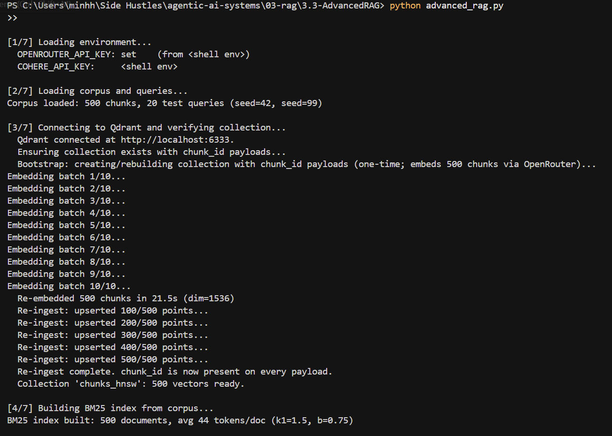
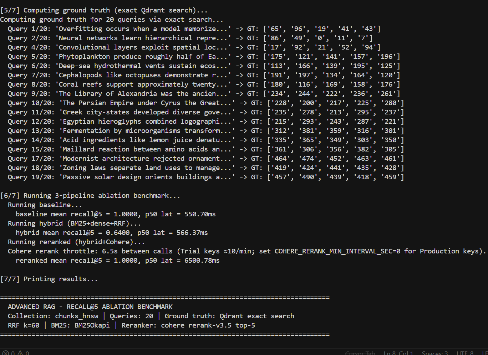
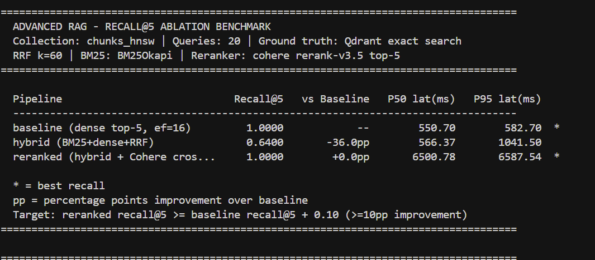
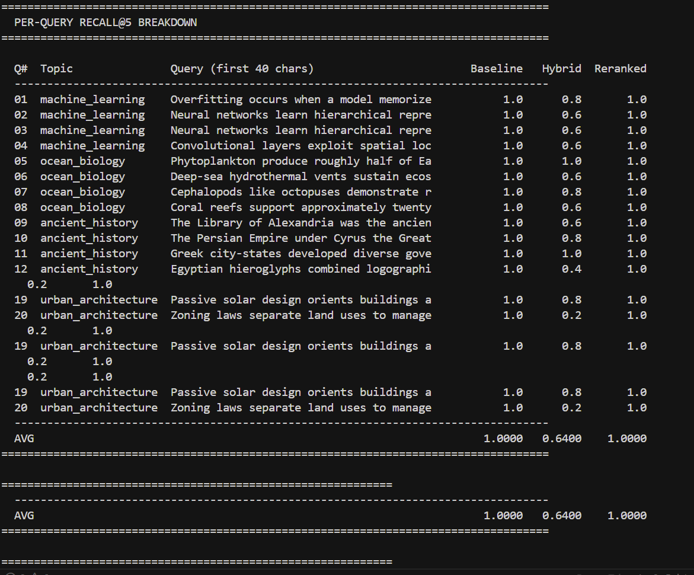
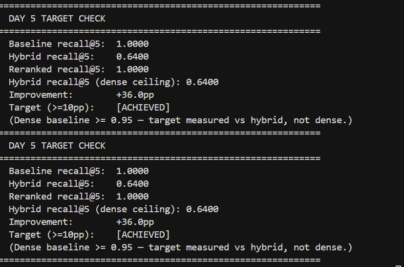

# 03.3 — Advanced RAG (Hybrid Search + Cross-encoder Reranking)

Day 5 module: **BM25 sparse retrieval** fused with **Qdrant dense ANN** via **Reciprocal Rank Fusion (RRF, k=60)**, then optional **Cohere rerank-v3.5** on a 20-candidate pool. The full stack is benchmarked on Day 3's 500-chunk / 20-query corpus with exact-search ground truth. Raw SDKs only — no RAG orchestration frameworks.

## Results

Benchmark screenshots from a successful run (baseline / hybrid / reranked + target check):







## Folder layout

```text
3.3-AdvancedRAG/
├── advanced_rag.py          # CLI entrypoint and 7-step benchmark
├── README.md
├── requirements.txt
├── pytest.ini
├── conftest.py
├── .env.example
├── .gitignore
├── results/                 # Benchmark screenshots (referenced above)
├── src/
│   ├── corpus_bridge.py     # Day 3 corpus + queries (DRY import)
│   ├── bm25_retriever.py    # BM25Okapi index and search
│   ├── dense_retriever.py   # Qdrant HNSW search + chunk_id bootstrap
│   ├── rrf_fusion.py        # RRF from scratch (k=60)
│   ├── reranker.py          # Cohere cross-encoder rerank
│   ├── ground_truth.py      # Exact Qdrant GT + recall@5
│   ├── recall_benchmark.py  # baseline / hybrid / reranked runners
│   └── reporter.py          # Ablation tables and target check
└── tests/                   # Offline + integration pytest suite
```

## Prerequisites

1. **Qdrant** on `localhost:6333`:

   ```powershell
   docker run -d --name qdrant_day3 --rm -p 6333:6333 -p 6334:6334 qdrant/qdrant:latest
   curl.exe -sf http://localhost:6333/healthz
   ```

2. **Day 3 collection** — run once so `chunks_hnsw` exists (500 vectors):

   ```powershell
   cd "03-rag\3.1-VectorDBs"
   python qdrant_bench.py
   cd ..\3.3-AdvancedRAG
   ```

   On first Day 5 run, if payloads lack `chunk_id`, the module **re-ingests** the same 500 chunks (same embeddings and HNSW settings as Day 3) with `chunk_id` in the payload.

3. **API keys** — copy `.env.example` to `.env` (or reuse `03-rag/3.2-NaiveRAG/.env`):

   | Variable | Required | Purpose |
   |----------|----------|---------|
   | `OPENROUTER_API_KEY` | Yes | Dense embeddings (`text-embedding-3-small`, 1536-dim) |
   | `COHERE_API_KEY` | No | Cross-encoder rerank; without it, reranked = dense backfill only |
   | `COHERE_RERANK_MIN_INTERVAL_SEC` | No | Default `6.5` — proactive spacing for **Trial** keys (10/min). Set `0` for Production keys. |
   | `COHERE_RERANK_429_MIN_BACKOFF_SEC` | No | Default `6.5` — minimum wait after a 429 even when `MIN_INTERVAL_SEC=0`. |
   | `COHERE_RERANK_MAX_RETRIES` | No | Default `3` — retries on rate limit before RRF fallback. |
   | `QDRANT_URL` | No | Default `http://localhost:6333` |
   | `COLLECTION_NAME` | No | Default `chunks_hnsw` |

   `advanced_rag.py` walks `.env` files in this folder, `3.2-NaiveRAG`, and the repo root, and treats placeholder values as unset.

## Setup (Windows PowerShell)

```powershell
cd "03-rag\3.3-AdvancedRAG"
python -m venv .venv
.\.venv\Scripts\Activate.ps1
python -m pip install -r requirements.txt

Copy-Item ".env.example" ".env"
# Add OPENROUTER_API_KEY (and optionally COHERE_API_KEY)

python advanced_rag.py
```

## CLI

| Flag | Default | Meaning |
|------|---------|---------|
| `--debug` | off | After the benchmark, print a 50-row RRF table for the query with the earliest BM25-only fused hit (consensus vs BM25-only vs dense-only). |
| `--skip-ground-truth` | off | Reuse in-process ground-truth cache (no new exact searches). |
| `--query "text"` | — | Single query through baseline, hybrid, and reranked; skip the 20-query benchmark. |
| `--top-n-bm25` | 50 | BM25 candidate pool; must be in [20, 100]. |
| `--top-n-dense` | 50 | Dense candidate pool; must be in [20, 100]. |
| `--rrf-k` | 60 | RRF smoothing constant (Cormack et al. 2009; do not change casually). |
| `--baseline-hnsw-ef` | 16 | HNSW `ef_search` for baseline dense top-5 only; hybrid/rerank pools use `ef=128`. |

```powershell
python advanced_rag.py --debug
python advanced_rag.py --query "neural networks backpropagation"
python advanced_rag.py --baseline-hnsw-ef 32
```

## Pipeline architecture

```text
query ──┬──> BM25 top-50 ────────────────┐
        │                                 ├──> RRF (k=60) ──> top-5  (hybrid)
        └──> Qdrant dense top-50 ────────┘              │
                                                        └──> top-20 ──> Cohere rerank ──> top-5 (reranked)

query ──> Qdrant dense top-5 ─────────────────────────────────────────> top-5 (baseline)
```

## RRF (k = 60)

RRF combines ranked lists **without comparing raw scores** (BM25 scores and cosine similarity are not comparable):

```text
RRF(doc) = sum over each system of  1 / (k + rank_in_that_system)
```

Ranks are **1-indexed**. Documents missing from a system's list contribute **0** for that system. With k=60, rank 1 scores `1/61 ≈ 0.01639`; consensus across dense and BM25 beats a single-system #1.

## Tests

```powershell
cd "03-rag\3.3-AdvancedRAG"

# Offline only (~3s): no Qdrant, no API calls
python -m pytest tests\ -v -m "not integration"

# Full suite (integration auto-skips if Qdrant/keys missing)
python -m pytest tests\ -v
```

Markers: `integration` (Qdrant + keys), `slow` (full CLI benchmark).

## Expected benchmark behavior

The ablation uses **two HNSW ef values** on purpose:

| Stage | `hnsw_ef` | Role |
|-------|-----------|------|
| **Baseline** (dense top-5) | **16** (default) | Fast production ANN — leaves recall headroom vs exact GT |
| **Hybrid / rerank pools** | **128** | Wider candidate pool so GT neighbours enter RRF + Cohere |

The **reranked** pipeline uses a production **cascade**:

1. Dense-anchored rerank pool (top-10 dense + RRF tail, 20 docs)
2. Cohere cross-encoder picks top **2** precision slots (within dense top-5 only)
3. Remaining slots stay in **high-ef dense rank order** (recall floor)

When dense baseline recall is **≥ 0.95** (common on 500 vectors), the **+10pp target** is measured against **hybrid** recall, not dense — reranking fixes RRF’s recall gap, not an already-perfect ANN top-5.

Illustrative table shape:

```text
  Pipeline                            Recall@5   vs Baseline   P50 lat(ms)   P95 lat(ms)
  baseline (dense top-5)                1.0000            --          ...
  hybrid (BM25+dense+RRF)               0.xxxx        +X.Xpp          ...
  reranked (hybrid + Cohere ...)        0.xxxx        +X.Xpp          ...
```

## Techniques at a glance

| Technique | What it fixes | When to skip |
|-----------|---------------|--------------|
| BM25 | Exact-token matches dense embeddings blur | Pure paraphrase, no lexical overlap |
| RRF | Incompatible score scales between retrievers | Well-calibrated scores + learned fusion |
| Cohere rerank | Bi-encoder flattens phrase-level relevance | Baseline already near-perfect; tight latency budget |
| Candidate pool 20→5 | Precision gate before LLM context | No reranking stage |

## What Day 6 adds

OCR-aware PDF ingestion and structured loading so a **real messy corpus** can show measurable hybrid and rerank lifts instead of a ceiling imposed by the synthetic 500-chunk lab set.
