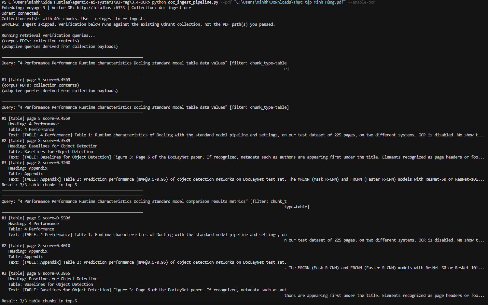
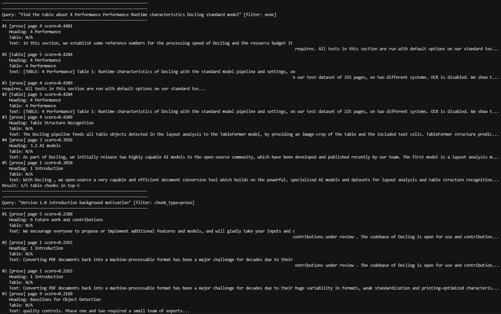
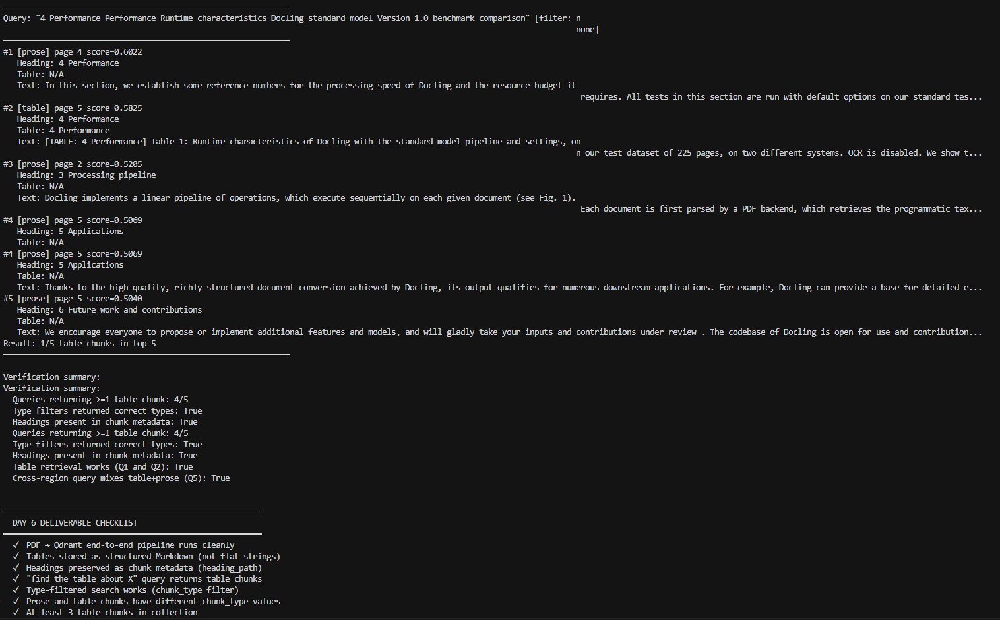

# 3.4 — OCR & Document Ingestion Pipeline (Day 6)

Production-style PDF ingestion: [Docling](https://github.com/docling-project/docling) parses documents into **typed regions**, a **type-aware chunker** routes each region, **Voyage `voyage-3`** embeds chunks, and **Qdrant** stores rich metadata (`heading_path`, `chunk_type`, `table_title`, …). A built-in verification suite checks that table chunks are retrievable by semantic query.

**Zero LangChain. Zero LlamaIndex.** Raw Docling, `qdrant-client`, and the embedding API only.

## Results:




## What this module proves

| Goal | How |
| --- | --- |
| Tables as structured text | Markdown via `table.export_to_markdown()`, prefixed `[TABLE: …]` |
| Section context | `heading_path` on every chunk; headings are not embedded alone |
| Reading order | Regions sorted by Docling layout before chunking |
| Region-aware chunking | Prose vs table vs figure strategies in `region_chunker.py` |
| “Find the table about X” | Adaptive verification queries + optional `chunk_type=table` filter |

## Architecture

```text
PDF
 │
 ▼
pdf_classifier.classify_pdf        digital / scanned / hybrid  +  needs_ocr
 │
 ▼
docling_parser.parse_pdf_to_regions ── Docling fails ──► _pdfplumber_fallback
 │
 ▼
typed region dicts  (title, heading, text, table, list, figure, caption)
 │
 ▼
region_chunker.chunk_regions
 ├─ text / list   → prose chunks (sentence-aware, 300 tok, 30 overlap)
 ├─ table         → table_serializer (Markdown, [TABLE: …])
 ├─ figure        → metadata-only locator chunk
 └─ title/heading → heading_path stack only (never embedded)
 │
 ▼
embedder.embed_chunks  (Voyage voyage-3, input_type="document")
 │
 ▼
vector_store.upsert_chunks  (Qdrant payload: chunk_type, heading_path, …)
 │
 ▼
verifier.run_verification  (5 queries; adaptive by default)
```

## Folder layout

```text
3.4-OCR/
├── doc_ingest_pipeline.py     # CLI: ingest + verification + Day 6 checklist
├── README.md
├── requirements.txt
├── pytest.ini
├── conftest.py                # pytest markers: integration, slow
├── .env.example
├── .gitignore
├── src/
│   ├── pdf_classifier.py      # born-digital vs scanned (per page)
│   ├── docling_parser.py      # Docling + pdfplumber fallback
│   ├── table_serializer.py    # table → Markdown, row-splitting
│   ├── region_chunker.py      # type-aware chunking
│   ├── embedder.py            # Voyage voyage-3 (strict, no hash fallback)
│   ├── vector_store.py        # Qdrant upsert + filtered search
│   └── verifier.py            # retrieval smoke tests
├── scripts/
│   └── generate_test_pdfs.py  # deterministic sample PDFs (reportlab)
├── sample_pdfs/               # test corpus (see sample_pdfs/README.md)
└── tests/
```

## Prerequisites

1. **Python 3.11+** (3.12 tested locally).

2. **Qdrant** on `localhost:6333`:

   ```powershell
   docker run -d --name qdrant_day6 -p 6333:6333 -p 6334:6334 qdrant/qdrant:latest
   curl.exe -sf http://localhost:6333/healthz
   ```

3. **API key** — copy `.env.example` to `.env` and set `VOYAGE_API_KEY`.

4. **Docling models** — first run downloads ~500MB to `HF_HOME` (default `./.hf_cache`). Allow 2–5 minutes once; later runs are fast.

## Setup (Windows PowerShell)

```powershell
cd "03-rag\3.4-OCR"
python -m venv .venv
.\.venv\Scripts\Activate.ps1
python -m pip install -r requirements.txt

Copy-Item ".env.example" ".env"
# Edit .env — set VOYAGE_API_KEY at minimum
```

## Usage

```powershell
# Generate sample PDFs (recommended first run)
python scripts/generate_test_pdfs.py

# Ingest sample corpus and run verification
python doc_ingest_pipeline.py --pdf-dir sample_pdfs/ --reingest

# Single PDF (use --reingest to replace an existing collection)
python doc_ingest_pipeline.py --pdf "C:\path\to\paper.pdf" --reingest

# Verification only (queries entire collection; no new PDF ingest)
python doc_ingest_pipeline.py --verify-only

# Scanned PDF (slow)
python doc_ingest_pipeline.py --pdf scanned.pdf --enable-ocr --reingest

# Per-region debug output
python doc_ingest_pipeline.py --pdf sample_pdfs\test_tables.pdf --debug
```

**Important:** If the collection already exists, the pipeline **skips ingest** unless you pass `--reingest`. Passing a new `--pdf` without `--reingest` only re-runs verification against whatever is already in Qdrant.

## Environment variables

| Variable | Default | Purpose |
| --- | --- | --- |
| `VOYAGE_API_KEY` | — | **Required.** Voyage embedding key. |
| `QDRANT_URL` | `http://localhost:6333` | Qdrant REST endpoint. |
| `COLLECTION_NAME` | `doc_ingest_ocr` | Collection name (separate from Day 3/4/5). |
| `HF_HOME` | `./.hf_cache` | Docling / HuggingFace model cache. |
| `DOCLING_ENABLE_OCR` | `false` | OCR hint; `--enable-ocr` also forces it. |
| `CHUNK_SIZE_TOKENS` | `300` | Target tokens per prose chunk. |
| `CHUNK_OVERLAP_TOKENS` | `30` | Prose chunk overlap. |
| `TABLE_MAX_ROWS_PER_CHUNK` | `20` | Split large tables after this many rows. |
| `VERIFICATION_ADAPTIVE` | `true` | Derive Q1–Q5 from ingested payloads (any PDF). |
| `VERIFICATION_FIND_TABLE_QUERY` | — | Q3 override when `VERIFICATION_ADAPTIVE=false`. |

## Tests

```powershell
cd "03-rag\3.4-OCR"

# Offline only (~2 min): no Qdrant, no API calls
python -m pytest tests\ -v -m "not integration"

# Full suite (integration auto-skips if Qdrant/keys missing)
python -m pytest tests\ -v
```

Markers: `integration` (Qdrant + `VOYAGE_API_KEY`), `slow` (full CLI e2e ingest).

## Key design decisions

- **Classify before parsing.** OCR on born-digital PDFs wastes time; skipping OCR on scans yields empty text. Per-page `pymupdf` classification gates Docling OCR.
- **Docling over pdfplumber.** DocLayNet region types + TableFormer grids; pdfplumber is a **fallback** only when Docling fails.
- **Tables as Markdown.** Flattening destroys row/column structure; `[TABLE: title]` prefixes make table intent searchable.
- **Headings are metadata, not chunks.** Titles/headings populate `heading_path` on child chunks.
- **Strict embeddings.** No hash fallback — bad vectors would silently break retrieval.
- **Adaptive verification.** Default queries are built from the first table/prose payloads in the collection, so custom PDFs (e.g. Docling Technical Report) pass without editing `verifier.py`. Set `VERIFICATION_ADAPTIVE=false` for the legacy `sample_pdfs/` query strings.

## Known limitations

1. **Figures** — metadata-only locator chunks (no vision captioning yet).
2. **Equations** — treated as text; equation detection disabled by default.
3. **Scanned PDFs** — require `--enable-ocr` (~30+ s/page on CPU).
4. **Large tables** — split with repeated header rows (storage overhead).
5. **Q3 unfiltered “find table”** — may rank prose above the table in top-5; the checklist only requires ≥1 table hit, not rank #1.

## What Day 7 adds

A real messy corpus (this pipeline) feeding hybrid search and reranking from Day 5, where synthetic lab ceilings no longer hide retrieval gains.
