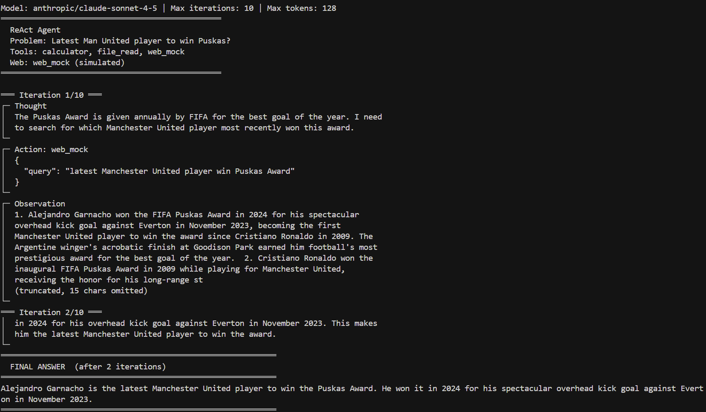

# Day 7 — ReAct Agent from Scratch

Zero LangChain. Zero LangGraph. Zero OpenAI SDK. Raw HTTP + Pydantic only.

## What is ReAct?

ReAct (Reasoning + Acting) is an agent pattern where the LLM alternates between **Thought** (explicit reasoning about what to do next), **Action** (calling a tool with structured JSON input), and **Observation** (the tool's result injected back into the conversation). Unlike hidden function-calling APIs, every reasoning step is visible in the trace. The model decides when it has enough information and emits a **FINAL ANSWER** instead of another Action.

## Results


## Setup

```powershell
cd 04-agents\4.1-ReAct
python -m venv .venv
.\.venv\Scripts\Activate.ps1
python -m pip install -r requirements.txt
copy .env.example .env
# Edit .env and set OPENROUTER_API_KEY
python react_agent.py
```

On managed Windows machines, use `python -m pip install` if `pip` is blocked by policy.

If trace characters look garbled, run `chcp 65001` first (UTF-8 console).

### Run tests (no API key required)

```powershell
python -m pytest -q
```

## Tools

| Tool | When | Output |
|------|------|--------|
| `calculator` | Arithmetic | `Result: …` |
| `file_read` | Files in `sample_data/` | Plain text |
| **`web_search`** (default) | Factual / time-sensitive questions | **JSON** `{query, provider, results:[{title,url,snippet}]}` |
| `web_mock` | Offline / no DuckDuckGo (`--mock-web` or `REACT_WEB_MODE=mock`) | Numbered prose snippets (LLM-generated) |

### Real search (`web_search`)

- Uses [DuckDuckGo](https://pypi.org/project/duckduckgo-search/) — **no extra API key**.
- Observations are structured JSON so grounding can read `results[].snippet` without regex hacks for every phrasing variant.
- Timeout: `WEB_SEARCH_TIMEOUT_SECONDS` (default `12`).

### Mock search (`web_mock`)

- Secondary LLM call at temperature `0.7` (simulates varied search results).
- Use for CI-style demos without network, or when DuckDuckGo is blocked:

```powershell
python react_agent.py --mock-web --query "Latest Man United player to win Puskas?"
```

Or in `.env`: `REACT_WEB_MODE=mock`

## Grounding (anti-hallucination)

The loop **rejects** a `FINAL ANSWER` when:

1. **Names** in the answer never appear in any prior Observation (including JSON snippets).
2. **“Latest …”** questions require a **year** in the answer and the **highest year** among scoped evidence chunks (e.g. Manchester United snippets for MU questions).
3. Chunks with denial language (`did not win`, `was nominated`, `unclear if`, …) are ignored for temporal checks.

The model must call `web_search` / `web_mock` again or answer: `I cannot determine this from the observations.`

## Example queries

```powershell
# Default demo (file_read + calculator)
python react_agent.py

# Real web search
python react_agent.py --query "Latest Man United player to win Puskas?"

# Simulated search (no DuckDuckGo)
python react_agent.py --mock-web --query "What is the capital of Norway?"

python react_agent.py --max-iterations 5 --quiet
```

## OpenRouter notes

### HTTP 402 — prompt token limit

Set `OPENROUTER_COMPACT_PROMPT=1` (default). Tune history:

```env
OPENROUTER_MAX_HISTORY_TURNS=1
OPENROUTER_MAX_OBS_CHARS=280
```

### HTTP 402 — insufficient credits

1. Add credits at [openrouter.ai/settings/credits](https://openrouter.ai/settings/credits), or  
2. Lower `OPENROUTER_MAX_TOKENS` to what your balance allows (avoid &lt;150 — truncates `Action:` / `FINAL ANSWER:`), or  
3. Use a cheaper `OPENROUTER_MODEL`.

Fatal 402/401/403 stops immediately (exit code `3`), not after 10 iterations.

## Architecture

```
react_agent.py (CLI)
       │
       ▼
react_loop.run_agent()     ← hard cap: range(1, max_iterations + 1)
       │
       ├── prompt_builder.build_conversation()
       ├── llm_client.call_llm(stop=["Observation:"])
       ├── parser.parse_llm_output()
       ├── grounding.check_final_answer_grounded()
       └── tool_registry.dispatch_tool()
                 ├── calculator / file_read
                 └── web_search  OR  web_mock
```

## Add a new tool in under 5 minutes

1. Define Pydantic schema + `execute_*` in `src/tools.py` (or a new module).  
2. Register in `src/tool_registry.py` → `build_tools_registry()`.  
3. `python react_agent.py --query "…"` — the system prompt picks it up via `get_tools_description()`.

## Project structure

```
04-agents/4.1-ReAct/
  react_agent.py
  src/
    llm_client.py       # raw OpenRouter HTTP
    react_loop.py       # ReAct loop + grounding hook
    parser.py
    prompt_builder.py
    tool_registry.py
    tools.py            # calculator, file_read, web_mock
    web_search.py       # DuckDuckGo → JSON observations
    grounding.py        # evidence-based FINAL ANSWER checks
    tracer.py
  tests/                # pytest (offline; network mocked)
  sample_data/notes.txt
  requirements.txt
  .env.example
  .gitignore
```

## Design: mock vs real search

| Approach | Pros | Cons |
|----------|------|------|
| **`web_search` + JSON** | Real facts; stable grounding on snippets | Needs network; DuckDuckGo rate limits |
| **`web_mock`** | No search API; good for format/loop tests | LLM may hallucinate or contradict itself |
| **Hardcoded prompt facts** | Fixes one demo query | Does not scale (removed from this repo) |

Production agents typically use **retrieval + structured tool output + grounding**, not growing regex/prompt cookbooks.

## Known limitations

- Single CLI query per run (no cross-run memory).
- `web_search` returns snippets only, not full pages.
- No human-in-the-loop before tool execution.
- Calculator uses `eval()` behind a strict regex (use `simpleeval` in production).

## Why no LangChain?

You own every layer: HTTP body, stop sequences, history truncation, parse recovery, and grounding. When something breaks, you know which file to open.
