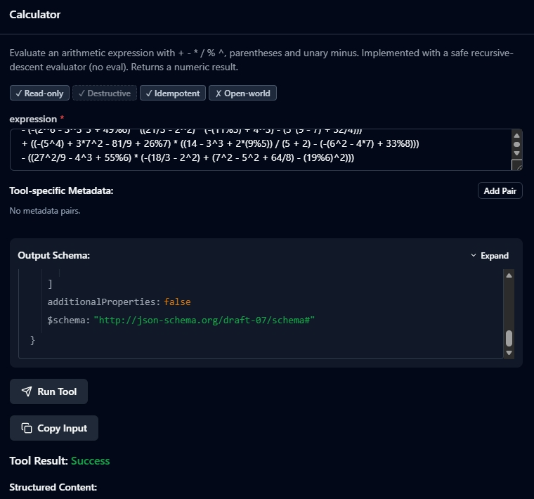
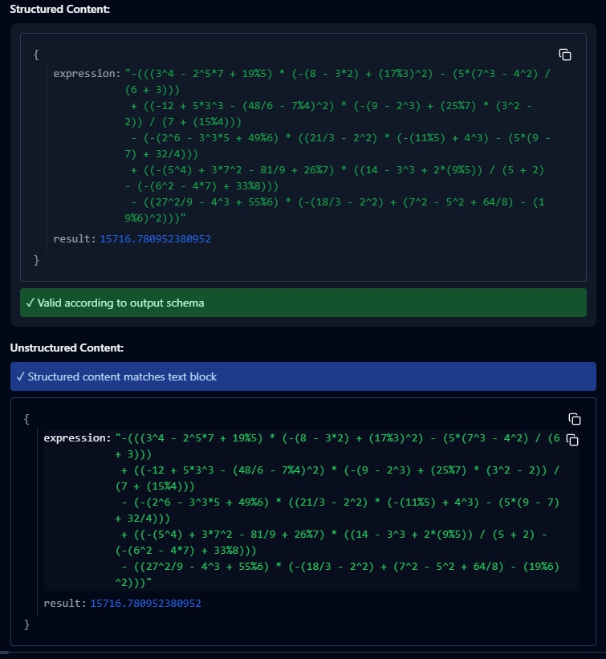
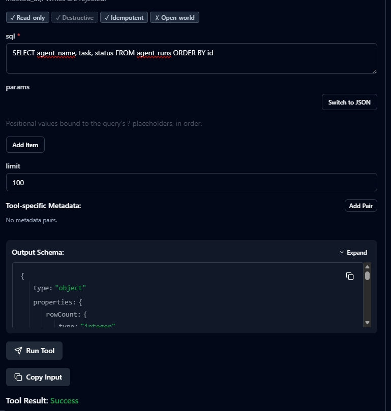
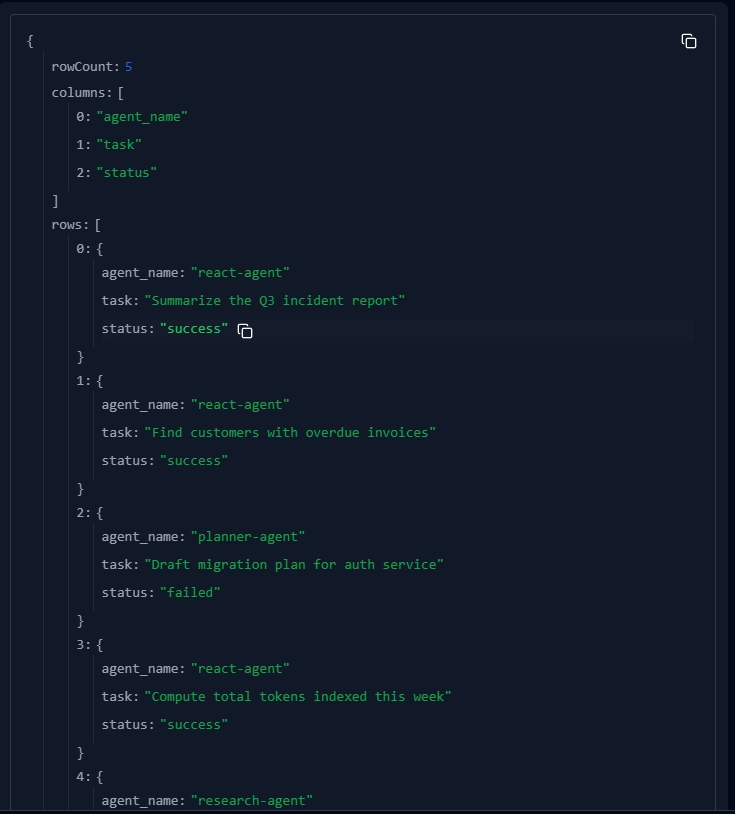
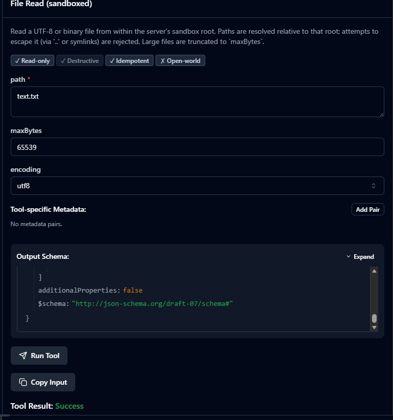
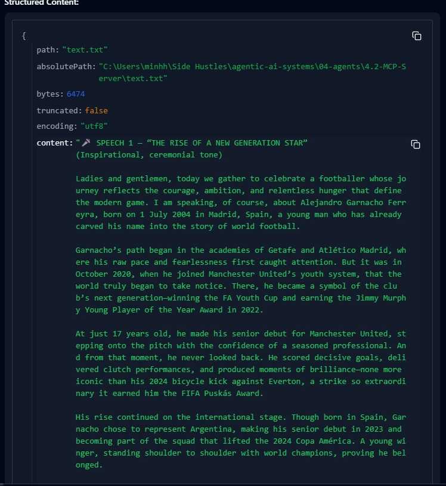

# 4.2 — MCP TypeScript Server (`sqlite_query` · `file_read` · `calc`)

An elite, production-shaped **Model Context Protocol** stdio server built with the
official [`@modelcontextprotocol/sdk`](https://github.com/modelcontextprotocol/typescript-sdk).
It exposes three tools with strict **Zod** input schemas and typed output schemas,
runs over **stdio**, and **never crashes on bad input** — every failure comes back
as a structured `{ isError: true }` result.

## Results:

#### Calculator:



#### SQL:



#### Readfile:



```
Client (MCP Inspector / Cursor)  ──stdio JSON-RPC──▶  this server
                                                        ├─ sqlite_query  (read-only SQLite)
                                                        ├─ file_read     (sandboxed filesystem)
                                                        └─ calc          (safe arithmetic, no eval)
```

---

## Quick start

```bash
cd 04-agents/4.2-MCP-Server
npm install          # installs SDK, zod, better-sqlite3 (prebuilt), tsx
npm run seed         # creates data/agent.db with sample agent-analytics data
npm run smoke        # spawns the server and runs 20 end-to-end assertions
```

Expected: `20 passed, 0 failed.`

| Script | What it does |
| --- | --- |
| `npm run seed` | (Re)builds `data/agent.db` — agent_runs, tool_calls, documents. |
| `npm run dev` | Run the server with hot reload (`tsx watch`). |
| `npm start` | Run the server with `tsx` (no build step). |
| `npm run build` | Compile TypeScript → `dist/` (used by the Cursor config). |
| `npm run typecheck` | Strict `tsc --noEmit`. |
| `npm run inspect` | Launch the **MCP Inspector** UI against this server. |
| `npm run inspect:cli` | Headless Inspector — prints `tools/list` as JSON. |
| `npm run smoke` | Full automated client↔server integration test. |

---

## The three tools

### 1. `sqlite_query` — read-only SQL
Runs a **single** `SELECT` / `WITH` / `PRAGMA` / `EXPLAIN` against the seeded DB.

- **Input:** `{ sql: string, params?: (string|number|boolean|null)[], limit?: 1–1000 }`
- **Output:** `{ rowCount, columns, rows, truncated }`
- **Safety (three layers):** Zod constraints → a keyword allow-list that rejects
  stacked statements and writes → a **read-only** better-sqlite3 connection with
  `PRAGMA query_only = ON`. A `DELETE`/`DROP` is rejected before it ever reaches SQLite.

```jsonc
// args
{ "sql": "SELECT tool_name, avg(latency_ms) AS ms FROM tool_calls GROUP BY tool_name" }
```

### 2. `file_read` — sandboxed file read
Reads a file, but only from inside `MCP_FILE_ROOT` (default: this project dir).

- **Input:** `{ path: string, maxBytes?: ≤1MiB, encoding?: "utf8"|"base64" }`
- **Output:** `{ path, absolutePath, bytes, truncated, encoding, content }`
- **Safety:** the requested path is resolved against the sandbox root and rejected if
  it escapes via `..` **or** a symlink (verified with `realpath`). `../../etc/passwd`
  returns a structured `FORBIDDEN`.

### 3. `calc` — safe arithmetic
Evaluates `+ - * / % ^`, parentheses, and unary minus.

- **Input:** `{ expression: string }`  · **Output:** `{ expression, result }`
- **Safety:** **no `eval` / `new Function`.** A tokenizer + recursive-descent parser
  is the only thing that runs. Conventional precedence: `2 * -3 = -6`, `-2^2 = -4`.
  Division by zero → structured error.

Every tool also carries MCP **annotations** (`readOnlyHint`, `idempotentHint`,
`openWorldHint: false`) so clients can render and gate them correctly.

---

## Testing in the MCP Inspector (do this first)

Always validate the deterministic server **before** attaching a probabilistic LLM —
this isolates "my code is broken" from "the model is confused."

```bash
npm run build      # so the same dist can also be used by Cursor
npm run inspect    # opens the Inspector UI (e.g. http://localhost:6274)
```

In the UI: **Connect → Tools → List Tools** (all three appear) → fill a form → **Run**.
Watch the **JSON-RPC trace** pane to see raw `initialize` / `tools/list` / `tools/call`
payloads. Try a bad input (e.g. `sqlite_query` with `DROP TABLE ...`) and confirm you
get a structured error, not a stack trace.

Headless equivalent (great for CI):

```bash
npm run inspect:cli
```

---

## Connecting to Cursor

Cursor's agent (Composer) acts as the MCP **client**. It launches stdio servers as
subprocesses that inherit your OS permissions — so we scope the sandbox via env vars.

1. `npm run build` (creates `dist/index.js`).
2. Open [`.cursor/mcp.json`](.cursor/mcp.json) in this folder — it's a ready template.
   Copy the `agent-tools` block into the `.cursor/mcp.json` of the folder you open as
   your Cursor workspace (e.g. the repo root), or into your global `~/.cursor/mcp.json`.
3. Restart Cursor. Open Settings → MCP and confirm **agent-tools** shows three tools.
4. In Composer, ask: *"Using the agent-tools server, how many documents are indexed,
   and what is 2^16 / 1024?"* — it will call `sqlite_query` and `calc` live.

```jsonc
{
  "mcpServers": {
    "agent-tools": {
      "command": "node",
      "args": ["<abs>/04-agents/4.2-MCP-Server/dist/index.js"],
      "env": {
        "MCP_DB_PATH":   "<abs>/04-agents/4.2-MCP-Server/data/agent.db",
        "MCP_FILE_ROOT": "<abs>/04-agents/4.2-MCP-Server"
      }
    }
  }
}
```

> Prefer no build step? Use `"command": "node", "args": ["--import","tsx","<abs>/src/index.ts"]`.

---

## Graceful shutdown

`src/index.ts` installs idempotent handlers for `SIGINT`, `SIGTERM`, `SIGHUP`, and
stdin-close. On any of them it closes the MCP transport, releases the SQLite handle,
logs to **stderr**, and exits `0` — no orphaned (zombie) subprocess, no leaked DB lock.
`uncaughtException` / `unhandledRejection` are logged but kept alive as a last resort.

---

## The five concepts (study notes)

- **MCP tool vs function calling.** Function calling is an LLM API feature (emit JSON
  args). MCP is the interoperability *protocol* around it: the client *discovers*
  tools at runtime via `tools/list`, then uses function calling to fill the args, then
  ships them back to the server for execution. Write the tool once → any MCP client
  (Cursor, Claude Desktop, custom agents) can use it. (N:M, not 1:1.)
- **Why stdio is the default for local tools.** The client spawns the server as a
  subprocess and talks over stdin/stdout. Zero network config, zero auth, and the OS
  *is* the security boundary — the server inherits exactly your file permissions.
  (Corollary: **never** write to stdout for logging — it corrupts the JSON-RPC stream.
  This server logs only to stderr; see `src/logger.ts`.)
- **Resources vs tools.** Resources are read-only, idempotent, URI-addressed *context*
  (the model's "eyes"). Tools are *actions* with a name + input schema (the model's
  "hands"). Strictly, `file_read` is really a Resource; it's a Tool here only because
  the brief asks for three tools — hence the `readOnlyHint`/`idempotentHint` annotations.
- **How Cursor discovers & calls servers.** It reads `.cursor/mcp.json`, spawns each
  stdio server, runs the `initialize → initialized → tools/list` handshake, and injects
  the (context-filtered) tool schemas into Composer. Tool calls are surfaced in the UI
  for transparency before execution.
- **Security model — what the LLM can/can't touch.** No ambient authority: the model
  only sees the tool *interface*, never DB credentials, file contents outside the
  sandbox, or env vars. Servers are isolated from each other. Here that's enforced
  concretely: read-only DB connection, `MCP_FILE_ROOT` sandbox, and an arithmetic
  evaluator with no code-execution path.

---

## Project layout

```
4.2-MCP-Server/
├─ package.json            scripts + pinned deps
├─ tsconfig.json           NodeNext, strict, noUncheckedIndexedAccess
├─ .cursor/mcp.json        Cursor wiring template (build first)
├─ data/agent.db           generated by `npm run seed` (gitignored)
└─ src/
   ├─ index.ts             bootstrap + tool registration + graceful shutdown
   ├─ config.ts            env-overridable paths (DB_PATH, FILE_ROOT)
   ├─ logger.ts            stderr-only logger (stdout is the JSON-RPC channel)
   ├─ errors.ts            ToolError + safeHandler (structured error envelope)
   ├─ db.ts                read-only better-sqlite3 connection
   ├─ seed.ts              deterministic DB seeder
   ├─ smoke.ts             end-to-end client↔server test (20 assertions)
   └─ tools/
      ├─ sqlite-query.ts   read-only SQL, 3-layer safety
      ├─ file-read.ts      sandboxed read, traversal + symlink guards
      └─ calc.ts           tokenizer + recursive-descent evaluator (no eval)
```

## Requirements

Node ≥ 20 (developed on Node 24). `better-sqlite3` ships prebuilt binaries for current
Node releases, so no C++ toolchain is needed. If you pin an older `better-sqlite3` that
lacks a prebuild for your Node version, it will try to compile from source.
