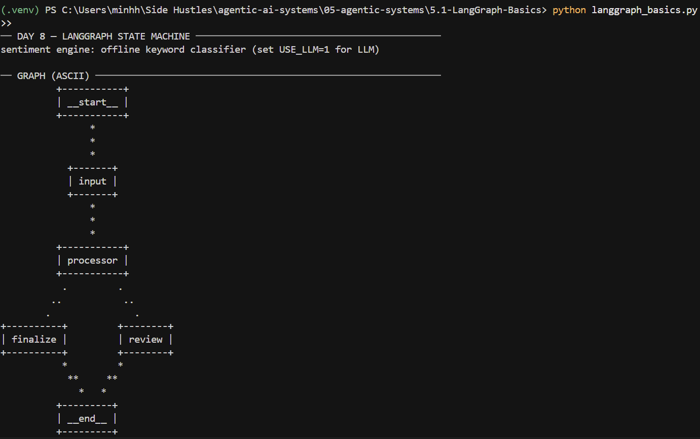
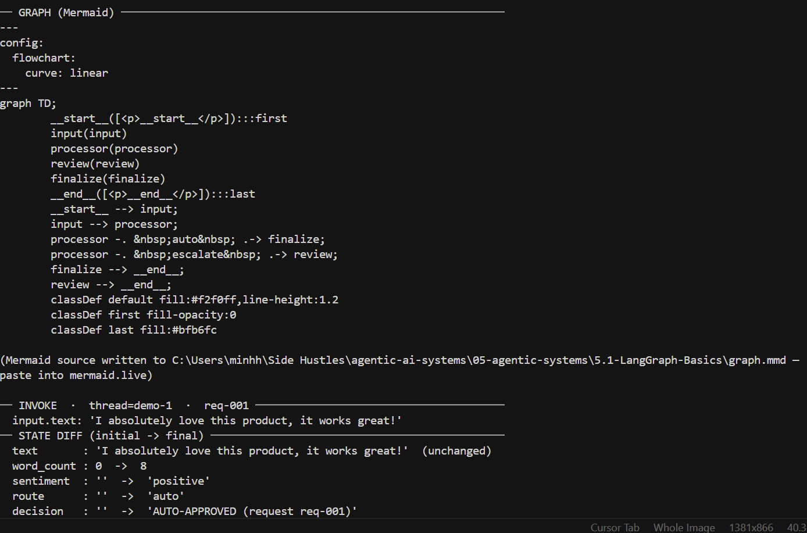
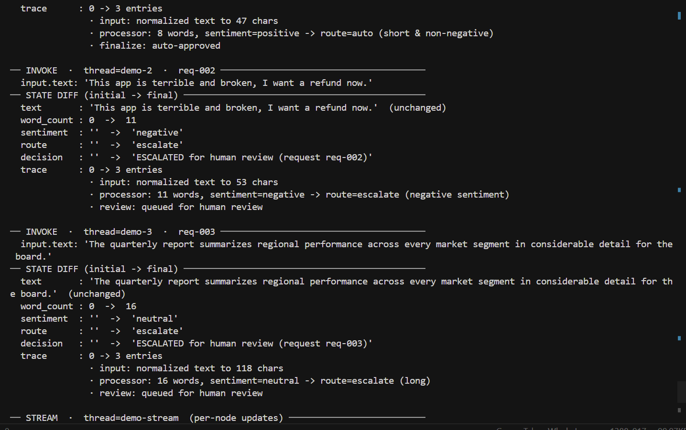
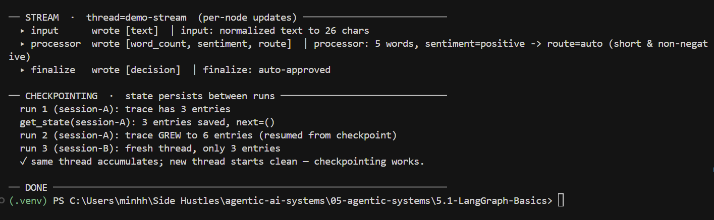

# Day 8 — LangGraph State Machines (basics)

> Module 05 · artifact 5.1 · `langgraph_basics.py`

A single, runnable file that teaches the five ideas every LangGraph program is
built on, then proves them with a 2-node graph that compiles, routes
conditionally, types its state, and checkpoints between runs.

**It runs fully offline and deterministically — no API key required.**

```bash
python -m venv .venv
.venv\Scripts\activate            # Windows  (source .venv/bin/activate on macOS/Linux)
pip install -r requirements.txt
python langgraph_basics.py
```

## Results

The run prints the compiled graph (ASCII + Mermaid), a per-field state diff for
each of three inputs, the same graph under `.stream()`, and the checkpoint
accumulation proof:






---

## The five concepts

| # | Concept | One-sentence mental model | Where to see it in the code |
|---|---------|---------------------------|-----------------------------|
| 1 | **State object** | The single typed dict that flows between nodes — the graph's *only* memory. No hidden globals; if it isn't in state, it doesn't exist downstream. | `PipelineState` (TypedDict, 7 typed fields) |
| 2 | **Nodes are pure functions** | A node is `f(state) -> partial_state`. It reads state, returns the fields it changes, and never mutates in place — which is what makes it testable, resumable, and parallel-safe. | `input_node`, `processor_node`, `review_node`, `finalize_node` |
| 3 | **Conditional edges** | Routing = a pure function `state -> next_node_key` whose return value the graph maps to the next node. Branching, early-exit, loops are all "look at state, decide where to go". | `route_after_processor` + `add_conditional_edges(...)` |
| 4 | **Compile** | `StateGraph` is a mutable *blueprint*; `.compile()` validates the topology and freezes it into an executable engine — and is where you attach the checkpointer. | `build_graph()` → `builder.compile(checkpointer=...)` |
| 5 | **invoke vs stream vs astream** | Same machine, three deliveries: `invoke` returns only the final state; `stream` yields per-node updates as they happen; `astream` is the async version for event-loop servers. | `run_one` (invoke), `demo_stream` (stream) |

### Why a reducer matters (the `trace` field)

Most state fields **overwrite** on each write. The `trace` field is declared
`Annotated[list[str], operator.add]`, so writes **append** instead. This single
choice is what makes checkpoint accumulation visible: re-invoking on the same
`thread_id` resumes the saved state and grows the trace (3 → 6 entries), while a
fresh `thread_id` starts clean (3 entries). That divergence *is* the checkpoint.

---

## The architecture — draw this by hand

```
          ┌───────────┐
  START ─→ │   input   │   normalize text
          └───────────┘
                │  (unconditional edge)
                ▼
          ┌───────────┐
          │ processor │   word_count + sentiment  →  decide route
          └───────────┘
                │
        ╭───────┴───────╮   ◀── CONDITIONAL EDGE: route_after_processor(state)
        │               │
 route=="auto"    route=="escalate"
        │               │
        ▼               ▼
  ┌──────────┐     ┌────────┐
  │ finalize │     │ review │      write terminal `decision`
  └──────────┘     └────────┘
        │               │
        ╰───────┬───────╯
                ▼
               END
```

- **`input`** and **`processor`** are the two-node spine: `START → input → processor`.
- A **conditional edge** off `processor` dispatches on the `route` it computed:
  - `negative` sentiment **or** ≥ `LONG_TEXT_THRESHOLD` words → **escalate** → `review`
  - otherwise → **auto** → `finalize`
- Both leaves write `decision` and go to **END**.

The program also prints this as **ASCII** (`get_graph().draw_ascii()`) and
**Mermaid** (`get_graph().draw_mermaid()`, saved to `graph.mmd` — paste into
[mermaid.live](https://mermaid.live)).

---

## The typed state

```python
class PipelineState(TypedDict):
    text: str                                   # provided; input normalizes it
    request_id: str                             # provided; carried through
    word_count: int                             # written by processor
    sentiment: str                              # written by processor
    route: str                                  # written by processor → drives the edge
    decision: str                               # written by a leaf node
    trace: Annotated[list[str], operator.add]   # APPENDED by every node (reducer)
```

`pydantic`'s `GraphInput` validates raw input at the boundary (rejects blank
text) *before* it becomes graph state — static typing from the TypedDict, runtime
validation from pydantic.

---

## What the run proves (maps to the goals)

| Goal | Demonstrated by |
|------|-----------------|
| 2-node graph compiles and runs | `build_graph()` compiles; three invokes complete |
| Conditional routing works | inputs hit **both** `auto` (finalize) and `escalate` (review) branches |
| State is typed | `PipelineState` TypedDict + `GraphInput` pydantic validation |
| Checkpoint saves between runs | same `thread_id` trace grows 3 → 6; fresh thread stays 3 |
| Draw the graph by hand | ASCII + Mermaid output, and the diagram above |
| Invoke 3 inputs, print state diff | `run_one` prints a before→after diff per field |

---

## Configuration

| Env var | Default | Effect |
|---------|---------|--------|
| `USE_LLM` | `0` | `1` swaps the offline keyword sentiment for an OpenRouter LLM call |
| `OPENROUTER_API_KEY` | — | required only when `USE_LLM=1` |
| `OPENROUTER_MODEL` | `anthropic/claude-sonnet-4-5` | model for the optional LLM path |
| `OPENROUTER_BASE_URL` | `https://openrouter.ai/api/v1` | OpenRouter endpoint |

The graph **topology is identical** with or without the LLM — only how
`sentiment` is computed changes. The offline path is deterministic so the printed
state diffs are reproducible run to run.

---

## File map

| File | Purpose |
|------|---------|
| `langgraph_basics.py` | the whole demo — state, nodes, router, compile, visualize, invoke/stream, checkpoint |
| `test_langgraph_basics.py` | 28 tests proving every goal (G1–G6) + the 3 "common mistakes" (purity, missing thread_id, reducer). Run `python -m pytest -v` |
| `requirements.txt` | pinned deps (langgraph, langchain-openai, pydantic, typing_extensions, grandalf, pytest) |
| `.env.example` | optional OpenRouter config for `USE_LLM=1` |
| `results/` | screenshots of the run (graph, state diffs, checkpoint proof) |
| `graph.mmd` | Mermaid source written at runtime (git-ignored) |

---

<sub>↑ [Module 05 — Agentic Systems](../README.md) · → [Day 9 — Multi-Agent Research](../5.2-Multi-Agent-Research/README.md)</sub>
