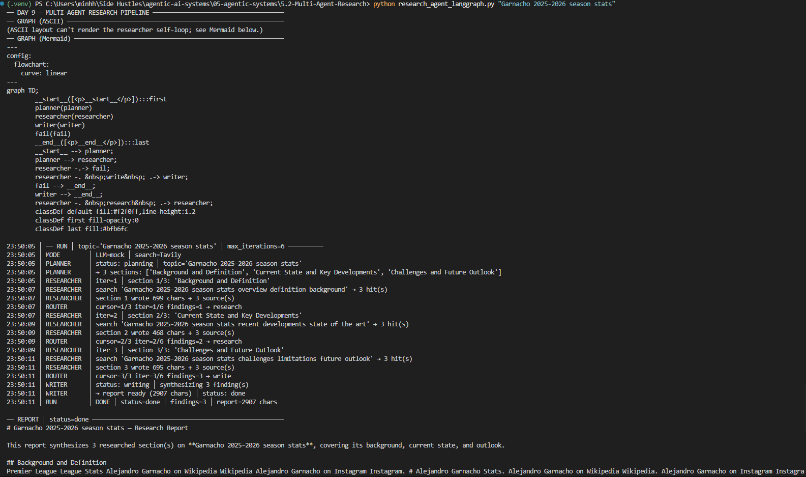
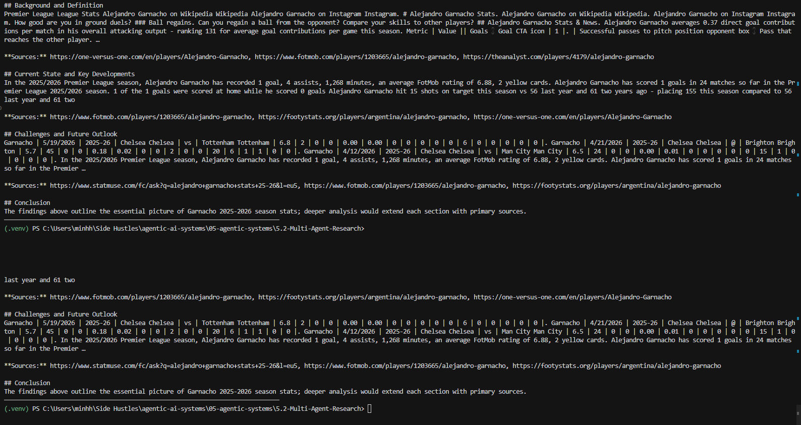

# Day 9 — Multi-Agent Research Pipeline

> Module 05 · artifact 5.2 · `research_agent_langgraph.py`

Three specialized agents — **Planner → Researcher → Writer** — collaborate inside
**one** LangGraph `StateGraph` to turn a topic into a structured, 3-section
report. Each agent is a node; they communicate only through shared, accumulating
state; the researcher loops itself (guarded by `max_iterations`); and if it finds
nothing, the graph still terminates with a clean report instead of crashing.

**Runs fully offline and deterministically by default** (mock LLM + mock search) —
no API keys required.

## Results



```bash
python -m venv .venv
.venv\Scripts\activate            # Windows  (source .venv/bin/activate on macOS/Linux)
pip install -r requirements.txt
python research_agent_langgraph.py                       # built-in demos
python research_agent_langgraph.py "your topic here"     # one custom topic
python -m pytest -v                                       # 32 tests, all green
```

---

## The five Day-9 concepts

| # | Concept | One-sentence mental model | Where in the code |
|---|---------|---------------------------|-------------------|
| 1 | **Each agent is a node, not a separate graph** | All three agents live in one `StateGraph` and share one in-process state dict — no network handoffs, no serialization. | `build_graph()` registers `planner/researcher/writer` as nodes |
| 2 | **State accumulates across calls** | `findings` and `log` are `Annotated[..., operator.add]` reducers, so each researcher visit **appends** to the shared "whiteboard" instead of overwriting. | `ResearchState`, `researcher_node` returns `{"findings": [one]}` |
| 3 | **HITL vs autonomous loop** | This pipeline is **autonomous** (nothing here is destructive); the researcher self-loops until done or capped. The HITL hook is `compile(interrupt_before=["writer"])`. | `route_after_research`, see *HITL* note below |
| 4 | **Tool results pass between agents via state** | The researcher runs search + summarizes into `findings`; the writer reads `findings`. The data never moves by a direct call — only through shared state. | `researcher_node` → `findings` → `writer_node` |
| 5 | **Error recovery: a node returns, it does not raise** | Every node wraps risky work in `try/except` and returns `{"error": ...}`; the router reads it and routes to graceful failure. | all `*_node` functions, `fail_node` |

### HITL in one line

Nothing in this pipeline has a destructive side effect, so it runs autonomously.
To require human sign-off before publishing, compile with a breakpoint:

```python
graph = builder.compile(checkpointer=MemorySaver(), interrupt_before=["writer"])
```

The graph then pauses after research; a human inspects `state["findings"]` via
`graph.get_state(config)` and resumes with `graph.invoke(None, config)`.

---

## Architecture — draw this by hand

```
          ┌─────────┐        ┌────────────┐   research (more sections, under cap)
  START ─→ │ planner │ ─────→ │ researcher │ ───────────────────┐
          └─────────┘        └────────────┘ ←──────────────────┘  (self-loop:
            LLM #1               LLM #2 + web search                one section/visit)
          structured JSON           │
            3-section plan          │  route_after_research(state)
                                    ├──── write (findings > 0) ──→ ┌────────┐
                                    │                              │ writer │ ─→ END
                                    │                              └────────┘ LLM #3
                                    └──── fail  (findings == 0) ──→ ┌──────┐
                                                                    │ fail │ ─→ END
                                                                    └──────┘
```

- **`planner`** (LLM #1): topic → `ResearchPlan` JSON of exactly 3 sections
  (`title` + search `query`), validated by pydantic with a repair-retry → fallback.
- **`researcher`** (LLM #2 + search): researches the section at `cursor`, runs
  **Tavily** (or the deterministic mock), summarizes hits into a finding, appends
  it, advances the cursor, increments `iterations`, and **loops itself**.
- **`route_after_research`**: the conditional edge — `research` (loop), `write`
  (synthesize), or `fail` (nothing found). The **`max_iterations` guard** lives
  here: once `iterations >= max_iterations`, the loop stops even if sections remain.
- **`writer`** (LLM #3): synthesizes all accumulated `findings` into a formatted
  Markdown report.
- **`fail`**: graceful terminal node — still emits a *structured* report (the
  planned headings, each noting the gap), never a crash.

This is a Directed **Cyclic** Graph (the researcher self-loop); `max_iterations`
is what keeps the cycle finite, with LangGraph's `recursion_limit` as a backstop.

---

## The shared state (the communication bus)

```python
class ResearchState(TypedDict):
    topic: str
    max_iterations: int
    simulate_empty_search: bool                      # force 0 search hits (demo/test hook)
    plan: list[dict]                                 # planner: [{title, query}, ...]
    findings: Annotated[list[dict], operator.add]    # researcher: APPEND each visit
    cursor: int                                      # next section index
    iterations: int                                  # loop guard counter
    status: str                                      # planning|researching|writing|done|failed
    error: Optional[str]                             # error bus (set on fail, cleared on ok)
    report: str                                      # writer/fail output
    log: Annotated[list[str], operator.add]          # visible state-transition trail
```

---

## What the demos prove (maps to the goals)

| Goal / task | Demonstrated by |
|-------------|-----------------|
| Topic → structured 3-section report | **Demo 1** → `status=done`, 3 `##` sections, sources per section |
| State transitions visible in logs | every node logs `PLANNER/RESEARCHER/ROUTER/WRITER` lines **and** appends to `state["log"]` |
| Fails gracefully if researcher finds nothing | **Demo 2** (`run_research(..., simulate_empty_search=True)`) → `status=failed`, structured "No information found" report, no exception — and it triggers **regardless of search backend** (a live Tavily key can't mask it) |
| 3 nodes, planner→researcher→writer | `build_graph()` topology (asserted in tests) |
| Each node = own LLM call + prompt | `_PLANNER_SYSTEM`, `_RESEARCH_SYSTEM`, `_WRITER_SYSTEM` (3 distinct prompts) |
| Planner outputs structured JSON | `ResearchPlan` pydantic model + repair-retry |
| Researcher uses Tavily or mock | `_search` dispatches to `TavilyClient` or `_mock_search` |
| Writer synthesizes formatted report | `writer_node` → Markdown with `#`/`##` headers |
| `max_iterations` guard | **Demo 3** (`max_iterations=2`) → loop stops early, partial report |

---

## Configuration

| Env var | Default | Effect |
|---------|---------|--------|
| `USE_LLM` | `0` | `1` (+ `OPENROUTER_API_KEY`) uses real LLM nodes via OpenRouter; else deterministic mocks |
| `OPENROUTER_API_KEY` / `OPENROUTER_MODEL` / `OPENROUTER_BASE_URL` | — | OpenRouter config for the 3 LLM nodes |
| `USE_TAVILY` | `1` | real Tavily search when `TAVILY_API_KEY` is set; `0` forces the mock |
| `TAVILY_API_KEY` | — | enables real web search in the researcher |

Mode is logged at the start of every run (`MODE │ LLM=… │ search=…`). Mixed modes
are fine (e.g. real LLM + mock search). The mock paths are deterministic so the
report, the logs, and the graceful-failure path are reproducible and testable.

**Two behaviors worth knowing:**

- **`simulate_empty_search`** (`run_research(..., simulate_empty_search=True)`)
  forces every search to return nothing, short-circuiting *before* the backend.
  It's how the graceful-failure path is demonstrated deterministically — a real
  Tavily key returns hits for almost any string, so an obscure topic alone can't
  reliably reproduce "found nothing".
- **Mock summaries vs real prose.** With `USE_LLM=0` the researcher's "summary" is
  a deterministic *extractive* stitch of the search snippets (deduped, whitespace-
  collapsed, capped). With `search=Tavily + USE_LLM=0` you therefore get tidy but
  raw extracts, not written prose. Set `USE_LLM=1` to have the LLM nodes write
  polished summaries and the final report.

---

## File map

| File | Purpose |
|------|---------|
| `research_agent_langgraph.py` | the whole pipeline — state, 3 agent nodes, router, search tool, compile, visualize, run |
| `test_research_agent.py` | 32 tests proving every goal/task/concept (run `python -m pytest -v`) |
| `requirements.txt` | pinned deps (langgraph, langchain-openai, tavily-python, pydantic, typing_extensions, grandalf, pytest) |
| `.env.example` | optional OpenRouter + Tavily config |
| `graph.mmd` | Mermaid source written at runtime (git-ignored) |

---

<sub>↑ [Module 05 — Agentic Systems](../README.md) · ← [Day 8 — LangGraph Basics](../5.1-LangGraph-Basics/README.md)</sub>
