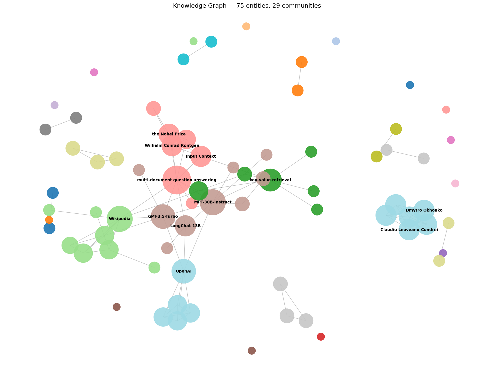

# 6.1 — Graph RAG: Entity Extraction

Turn an unstructured document into a **knowledge graph**: extract typed entities and
`(entity, relation, entity)` triples, build a NetworkX graph, embed entities into
Qdrant, visualize the entity clusters, and report the most-connected entities.

`entity_extractor.py` is the deliverable: **document in → NetworkX graph out**, saved
to disk, with a clustered visualization and a top-N report.

```
                ┌─────────┐   ┌───────────┐   ┌────────────────┐   ┌───────────┐
   document ──► │ loader  │──►│ extractor │──►│ disambiguation │──►│   graph   │
   (PDF/.txt)   └─────────┘   └───────────┘   └────────────────┘   └─────┬─────┘
                  pages       entities +        merge alias /             │ MultiDiGraph
                              triples           surface-form variants     │
                          (spaCy offline  /                               ├─► save  graph.graphml + graph.json
                           OpenRouter LLM)                                ├─► embed entities ─► Qdrant
                                                                          ├─► visualize ─► graph.png (clusters)
                                                                          └─► report  top-5 most-connected
```

## Run it

```bash
python -m venv .venv
.venv/Scripts/python.exe -m pip install -r requirements.txt
.venv/Scripts/python.exe -m spacy download en_core_web_sm

# offline & deterministic (default) — no API key, no network:
python entity_extractor.py --doc "path/to/paper.pdf"

# skip Qdrant / skip the image:
python entity_extractor.py --doc paper.pdf --no-qdrant --no-viz

# real LLM extraction (cleaner typed triples) + real semantic embeddings:
#   set OPENROUTER_API_KEY and USE_LLM=1 in .env, then:
python entity_extractor.py --doc paper.pdf
```

Qdrant runs locally in Docker:

```bash
docker run -d -p 6333:6333 -p 6334:6334 qdrant/qdrant:latest
```

By default only the **main body** (Abstract → References) is extracted; the title/author
front-matter and the bibliography are dropped because they extract as dense
co-occurrence noise (every cited author connects to every other) that swamps the real
entities. Pass `--include-back-matter` to keep them.

### Two extraction backends

| | Offline (default) | LLM (`USE_LLM=1` + key) |
|---|---|---|
| Entities | spaCy `en_core_web_sm` NER + domain lexicon | LLM typed extraction |
| Relations | intra-sentence co-occurrence, labeled by root verb | LLM `(source, relation, target)` |
| Determinism | fully reproducible (tests assert this) | non-deterministic |
| Quality | good; some NER mis-typing (`OpenAI`→PERSON) | clean, canonical, typed |
| Cost | free, offline | one API call per ~12K-char chunk |

The offline path keeps the whole pipeline and test suite hermetic; the LLM path is the
production-quality path. Both return the **same `ExtractionResult`**, so everything
downstream (disambiguation, graph, embeddings, viz) is backend-agnostic.

## Result on *Lost in the Middle* (Liu et al., 2023), offline

18-page PDF → 11-page body → **75 entities, 105 relations, 29 communities**. Top-connected
entities are the paper's real subject matter — the two tasks it studies and the models it
tests:

```
   #  entity                             type      degree  mentions
   1  multi-document question answering  CONCEPT       10         9
   2  MPT-30B-Instruct                   MODEL          8        13
   3  Wikipedia                          ORG            8         6
   4  GPT-3.5-Turbo                      MODEL          7        13
   5  key-value retrieval                CONCEPT        6        11
```



Colors are Louvain communities; node size is degree. The dense core holds the models and
the two task concepts; the peripheral clusters are example-content and citation groups.

---

## The five concepts

### 1. Why a graph beats vanilla RAG on multi-hop questions

Vanilla RAG retrieves chunks by **surface similarity** to the query, then asks the LLM to
answer from them. That works when the answer lives in one passage. It breaks on
**multi-hop** questions whose answer is spread across passages that don't individually
look like the query.

Take *"Which dataset was the instruction-tuned 30B model evaluated on?"* Answering needs
three hops: MODEL **is-a** instruction-tuned → MODEL **evaluated_on** DATASET. No single
chunk says "the instruction-tuned 30B model was evaluated on NaturalQuestions" in those
words, so vector search may never retrieve the right passages. A graph stores those hops
as **explicit edges** (`MPT-30B-Instruct —evaluated_on→ NaturalQuestions`); the answer is
a 1–2 step **traversal**, independent of how the question is phrased. Graph RAG turns
"hope the right chunks are lexically close" into "walk the edges."

### 2. What a "community summary" is and why it helps

Run community detection (Louvain/Leiden) on the graph and you get **densely-connected
sub-clusters** — e.g. an "evaluation models" cluster, a "datasets" cluster. A **community
summary** is a short LLM-written paragraph describing one cluster ("These entities are
the language models benchmarked in the long-context experiments…").

They answer **global / thematic** questions that local chunk retrieval can't:
*"What are the main themes of this corpus?"* Instead of stuffing every chunk into the
context window, you summarize a handful of community summaries — cheaper, and it actually
covers the whole corpus. This is the "global search" half of Microsoft GraphRAG. (Built in
a later day; this day produces the communities the summaries would run on — see the 29
communities colored in `graph.png`.)

### 3. Trade-off: graph construction cost vs query quality

Building the graph is **expensive up front**: an LLM extraction pass per chunk, then
disambiguation, clustering, and (later) a summary per community. Vanilla RAG's index cost
is basically just embedding the chunks.

You pay that one-time indexing cost to buy **cheaper, higher-quality answers** on
multi-hop and global questions at query time. The economics work when the corpus is
**stable** (you amortize indexing over many queries) and the questions are **relational or
global**. If the corpus changes constantly or questions are simple lookups, the graph
cost never pays back.

### 4. When to use Graph RAG vs. stick with vanilla

| Use **Graph RAG** when… | Stick with **vanilla** when… |
|---|---|
| Questions are multi-hop / relational | Questions are single-fact lookups |
| You need global/thematic summaries across docs | Answers live in one passage |
| The corpus is stable (indexing amortizes) | The corpus changes constantly |
| Connecting entities across documents matters | A tight indexing budget rules out LLM passes |

A common production pattern is **hybrid**: vanilla vector search for local lookups, graph
traversal + community summaries for the multi-hop and global questions.

### 5. How entity disambiguation works in practice

The same real entity appears under many **surface forms** — "UC Berkeley" vs "University
of California, Berkeley", "GPT-3.5" vs "GPT-3.5-Turbo", "claude" vs "Claude". If they stay
separate nodes, the graph **fragments**: edges that should reinforce one hub get scattered
across duplicates, and traversal misses connections.

Production entity resolution is a four-stage pipeline, and `disambiguation.py` is a compact
deterministic version of exactly it:

1. **Blocking** — only compare candidates that could plausibly match. Here: block by
   entity **type** (never compare a PERSON to an ORG), which also prevents wrong merges.
2. **Candidate generation** — seed known equivalences (acronyms/aliases).
3. **Pairwise scoring** — score each candidate pair (`rapidfuzz` token-set ratio ≥ 90 →
   same). Production adds embedding cosine similarity and learned matchers.
4. **Clustering** — union-find groups all matching pairs; pick a **canonical name** (most
   mentions, then longest) and fold the rest in as `aliases`. Triples are rewritten to
   canonical names so no edge points at a merged-away node.

Hard cases (e.g. two different people with the same name) get embedding context and human
review in real systems.

---

## The extraction prompt design (`extractor_llm.py`)

The LLM prompt is the heart of LLM-based Graph RAG. Five deliberate choices in
`_SYSTEM_PROMPT`, each preventing a specific failure mode:

| Choice | Prevents |
|---|---|
| **Fixed typed label set** (`PERSON, ORG, LOCATION, MODEL, DATASET, CONCEPT, WORK`) | untyped entity sprawl; keeps the graph queryable by type |
| **Strict JSON-only shape** (no prose, matches our Pydantic schema) | parse errors / having to scrape prose for structure |
| **"Only emit a triple whose source and target both appear in entities"** | dangling edges that point at non-existent nodes |
| **One-shot example** | wrong output format *and* wrong relation granularity |
| **"Canonical name + aliases"** | duplicate nodes — pushes first-pass disambiguation into the model |

Plus `temperature=0` for stability and chunking (~12K chars) so long documents stay within
context while results merge into one graph. The offline extractor approximates the same
contract deterministically (NER + co-occurrence) for tests and key-free runs.

---

## Goal → evidence

| Task / goal | Where | Proven by |
|---|---|---|
| Run extraction over a 10-page doc | `extractor.py`, `extractor_llm.py` | real run (body = 11 pp.) |
| Extract `(entity, relation, entity)` triples | `schema.Triple`, `extractor_offline.py` | `test_extractor_offline.py` |
| NetworkX graph: nodes=entities, edges=rels | `graph.build_graph` | `test_graph.py::test_nodes_are_entities_edges_are_relations` |
| Graph saved to disk | `graph.save_graph` (GraphML + JSON) | `test_graph.py::test_save_and_load_roundtrip` |
| Store entity embeddings in Qdrant | `embeddings.py`, `vector_store.py` | `test_vector_store.py` (live, gated) |
| Visualize graph showing clear clusters | `visualize.draw_graph` (Louvain coloring) | `test_visualize.py`, `out/graph.png` |
| Print top-5 most-connected entities | `graph.top_connected`, `report.py` | `test_report.py`, CLI output |
| Explain extraction prompt design | this README + `extractor_llm._SYSTEM_PROMPT` | — |

## Files

| File | Responsibility |
|---|---|
| `entity_extractor.py` | CLI orchestrator: load → extract → disambiguate → graph → save → Qdrant → viz → report |
| `src/config.py` | env-driven backend gating (offline default, opt-in LLM/embeddings) |
| `src/loader.py` | document → pages; main-body trimming (front/back matter) |
| `src/schema.py` | typed Pydantic models (`Entity`, `Triple`, `ExtractionResult`) |
| `src/extractor_offline.py` | deterministic spaCy NER + lexicon + co-occurrence extraction |
| `src/extractor_llm.py` | OpenRouter typed-triple extraction + the documented prompt |
| `src/extractor.py` | façade routing offline vs LLM |
| `src/disambiguation.py` | type-aware entity resolution (rapidfuzz + union-find) |
| `src/graph.py` | NetworkX build / save / load / top-N / undirected projection |
| `src/embeddings.py` | entity embeddings (OpenRouter API or deterministic offline) |
| `src/vector_store.py` | Qdrant entity collection (local Docker) |
| `src/visualize.py` | matplotlib render, nodes colored by community |
| `src/report.py` | top-N most-connected table |

## Test

```bash
PYTHONIOENCODING=utf-8 python -m pytest -q
```

31 tests; offline and deterministic. The live Qdrant test is skipped unless a local
server is reachable; the LLM extraction is exercised through pure parse/build helpers
that need no network.
