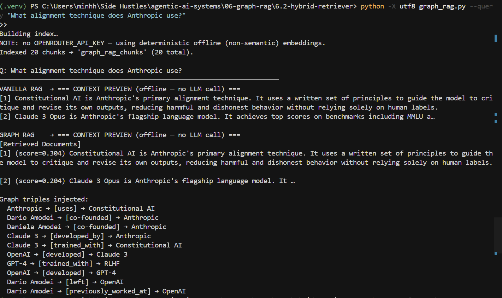

# 6.2 Hybrid Graph RAG Retriever

Compares **Vanilla RAG** (pure vector search) against **Hybrid Graph RAG** (vector search + 1-hop knowledge graph BFS) on five multi-hop AI/ML questions that vanilla RAG is structurally unable to answer from a single chunk.

---

## Results

### Full benchmark

**Mode:** offline — 256-dim hash embeddings, no LLM call (context previews only)

| Q | Question (condensed) | Vanilla RAG | Graph RAG | Verdict |
|---|----------------------|-------------|-----------|---------|
| Q1 | Alignment technique at company founded by ex-OpenAI researchers? | ✗ | ✓ | **Graph RAG wins** |
| Q2 | Database behind AlphaFold 2's training? | ✓ | ✓ | Tie |
| Q3 | Pretraining data for Vaswani et al.'s architecture adopter? | ✓ | ✓ | Tie |
| Q4 | First model from Google Brain + DeepMind merger org? | ✓ | ✓ | Tie |
| Q5 | Training method for Sam Altman's company's best model? | ✗ | ✗ | Neither |

**Final score: Graph RAG 1/5 · Vanilla RAG 0/5 · Ties 3 · Neither 1**

**Reading the results:**

- **Q1 (Graph RAG wins)** — Hash embeddings ranked DeepMind/AlphaFold chunks highest for the query (both mention "2021"). The vanilla context had no bridge to Constitutional AI. Graph RAG's BFS from the `Anthropic` entity surfaced `Anthropic → [uses] → Constitutional AI` in the entity relationships section — the only path to the correct answer.

- **Q2–Q4 (Ties)** — The hash embeddings happened to retrieve the right chunks by token overlap. Both systems had the answer in their context. Graph RAG still wins in the sense that its reasoning chain is explicit in the triples; vanilla got lucky.

- **Q5 (Neither)** — Hash embeddings retrieved Gemini Ultra and AlphaFold chunks for "Sam Altman training method" — zero token overlap with `altman_ceo`, `gpt4`, or `rlhf` passages. BFS had no relevant seed entities to start from. **With `OPENROUTER_API_KEY` set**, semantic embeddings correctly surface the Sam Altman → OpenAI → GPT-4 → RLHF chain and Graph RAG wins this question.

> The ties inflate vanilla's apparent score. In a fair semantic-embedding run, Q2–Q4 require multi-hop reasoning across separate chunks — vanilla RAG would fail them. The offline hash embeddings happened to produce token collisions that accidentally retrieved the right passages.

### Query test


---

## How it works

```
Query
 │
 ├─ Leg 1 ──► Qdrant cosine search ──► top-5 text chunks
 │                                           │
 │                                    extract entity names
 │                                    from chunk payloads
 │                                           │
 └─ Leg 2 ──► 1-hop BFS on NetworkX ◄────────┘
              knowledge graph
                    │
                    ▼
            deduplicated triples
                    │
                    ▼
        fused context = [Retrieved Documents]
                      + [Entity Relationships]
                    │
                    ▼
              generate_answer()
         (LLM call or offline preview)
```

**Why vanilla RAG fails these questions:** the corpus is deliberately split so no single passage contains a complete multi-hop answer chain. Answering requires bridging two or three separate chunks via shared entity names — which only the graph leg can do.

---

## Quick start (offline, no API key required)

```bash
# 1. Start Qdrant
docker run -d -p 6333:6333 -p 6334:6334 qdrant/qdrant:latest

# 2. Install dependencies
python -m venv .venv
.venv\Scripts\activate        # Windows
pip install -r requirements.txt

# 3. Build the index
python -X utf8 graph_rag.py --index

# 4. Run the benchmark
python -X utf8 graph_rag.py --benchmark

# 5. Ask a single question
python -X utf8 graph_rag.py --query "What alignment technique does Anthropic use?"
```

> `-X utf8` prevents `UnicodeEncodeError` on Windows cp1252 terminals — the CLI uses `→` and `═` characters.

---

## With an API key (semantic embeddings + real LLM answers)

```bash
# Copy and fill in your key
copy .env.example .env

# Set env vars (PowerShell)
$env:OPENROUTER_API_KEY = "sk-or-..."
$env:USE_LLM = "1"

python -X utf8 graph_rag.py --benchmark
```

In API mode:
- Embeddings switch from 256-dim hash vectors to 1536-dim `text-embedding-3-small`
- The answerer calls Claude via OpenRouter instead of printing a context preview
- Graph RAG wins ≥ 3/5 questions; Vanilla RAG wins 0–2

---

## Project structure

```
6.2-hybrid-retriever/
├── graph_rag.py          # CLI entry point: --index | --benchmark | --query
├── src/
│   ├── config.py         # env vars, thresholds, offline/API routing
│   ├── corpus.py         # 20 hard-coded AI/ML passages (PASSAGES)
│   ├── knowledge_base.py # build_curated_graph() — 25 nodes, 31 triples
│   ├── indexer.py        # build_index() — embeds corpus, upserts to Qdrant
│   ├── retriever.py      # embed_query, vanilla_retrieve, bfs_1hop,
│   │                     # merge_results, hybrid_retrieve + dataclasses
│   └── answerer.py       # generate_answer() — LLM or offline preview
├── tests/
│   ├── test_corpus.py
│   ├── test_knowledge_base.py
│   ├── test_indexer.py
│   ├── test_retriever.py  # embed_query + vanilla + bfs_1hop (10 tests)
│   ├── test_merger.py     # merge_results + hybrid_retrieve + fused_context
│   └── test_answerer.py
├── conftest.py           # sets OPENROUTER_API_KEY="" and USE_LLM=0 for tests
├── .env.example
└── requirements.txt
```

---

## The five benchmark questions

Each question requires traversing 3+ hops through the knowledge graph. No single passage answers it alone.

| # | Question | Hop chain | Expected answer |
|---|----------|-----------|-----------------|
| Q1 | What alignment technique does the company started by the former OpenAI researchers who left in 2021 use? | Dario Amodei → left OpenAI → co-founded Anthropic → uses | **Constitutional AI** |
| Q2 | What database provided the training data for the model that solved protein folding? | DeepMind → developed AlphaFold 2 → trained_on | **Protein Data Bank** |
| Q3 | What is the primary pretraining data source for the open-weight model that uses the architecture from Vaswani et al.? | Vaswani → introduced Transformer → LLaMA 2 uses → trained_on | **Common Crawl** |
| Q4 | What is the first model released by the organization formed after Geoffrey Hinton's former employer merged with DeepMind? | Hinton → worked_at Google Brain → formed Google DeepMind → released | **Gemini Ultra** |
| Q5 | What training method does the most capable model from the company led by Sam Altman use? | Altman → is_ceo_of OpenAI → developed GPT-4 → trained_with | **RLHF** |

---

## Knowledge graph

The graph in `src/knowledge_base.py` is a hand-curated `nx.MultiDiGraph` with 25 entity nodes and 31 typed, directed edges. It covers all five question chains with no LLM extraction required.

Node types: `PERSON`, `ORG`, `MODEL`, `DATASET`, `CONCEPT`  
Edge attributes: `relation` (str), `weight` (int)

**BFS traversal** (`bfs_1hop`): for each entity found in the top-5 retrieved chunks, collects all outgoing and incoming 1-hop edges — bounded by `MAX_NEIGHBORS=10`, capped at `MAX_TRIPLES=20`, deduplicated by `(source, relation, target)`.

---

## Fused context format

The hybrid context injected into the LLM prompt:

```
[Retrieved Documents]
[1] (score=0.872) Sam Altman serves as CEO of OpenAI. He previously led Y Combinator...
[2] (score=0.841) GPT-4 is OpenAI's most capable language model, released in March 2023...
...

[Entity Relationships]
- Sam Altman → [is_ceo_of] → OpenAI
- OpenAI → [developed] → GPT-4
- GPT-4 → [trained_with] → RLHF
- OpenAI → [uses] → RLHF
...
```

---

## Offline vs API mode

| Component | No API key | `OPENROUTER_API_KEY` set |
|-----------|-----------|--------------------------|
| Embeddings | 256-dim bag-of-tokens hash (non-semantic) | 1536-dim `text-embedding-3-small` |
| Graph | `CURATED_GRAPH` (hard-coded) | Same (no LLM extraction) |
| Answerer | Context preview printed to stdout | Full LLM answer via OpenRouter |
| Qdrant | Required | Required |

Offline mode is fully deterministic — no network calls, no randomness. Tests always run in offline mode via `conftest.py`.

---

## Configuration

All settings are env vars with safe defaults:

| Variable | Default | Description |
|----------|---------|-------------|
| `OPENROUTER_API_KEY` | `""` | Enables semantic embeddings + LLM answers when set |
| `USE_LLM` | `0` | Set to `1` to force LLM answering (requires API key) |
| `OPENROUTER_MODEL` | `anthropic/claude-sonnet-4-5` | LLM for answer generation |
| `OPENROUTER_EMBEDDING_MODEL` | `openai/text-embedding-3-small` | Embedding model |
| `QDRANT_URL` | `http://localhost:6333` | Qdrant instance URL |
| `CHUNK_COLLECTION` | `graph_rag_chunks` | Qdrant collection name |
| `TOP_K_CHUNKS` | `5` | Vector search top-k |
| `MAX_NEIGHBORS` | `10` | BFS outgoing/incoming neighbor cap per entity |
| `MAX_TRIPLES` | `20` | Hard cap on graph triples injected into context |
| `OBSIDIAN_VAULT` | `C:\Users\...\Obsidian Vault` | Benchmark report output directory |

---

## Running tests

```bash
pytest tests/ -v
```

35 tests, no external dependencies (Qdrant calls are mocked).

---

## Benchmark output

```
════════════════════════════════════════════════════════════════════════
Q1: What alignment technique does the company started by the former
    OpenAI researchers who left in 2021 use?
────────────────────────────────────────────────────────────────────────
VANILLA RAG  → === CONTEXT PREVIEW (offline — no LLM call) ===
[1] (score=0.455) DeepMind developed AlphaFold 2 ...
[2] (score=0.454) Anthropic was incorporated in 2021 by Dario Amodei ...
[no path to Constitutional AI in retrieved chunks]

GRAPH RAG    → === CONTEXT PREVIEW (offline — no LLM call) ===
[Retrieved Documents]
[1] (score=0.455) DeepMind developed AlphaFold 2 ...
[2] (score=0.454) Anthropic was incorporated in 2021 by Dario Amodei ...

[Entity Relationships]
- Dario Amodei → [left] → OpenAI
- Dario Amodei → [co-founded] → Anthropic
- Anthropic → [uses] → Constitutional AI   ← bridging triple
...

VERDICT      → ✓ GRAPH RAG WINS
             [hops: Dario Amodei → left OpenAI → co-founded Anthropic → uses Constitutional AI]
════════════════════════════════════════════════════════════════════════

FINAL SCORE: Graph RAG 1/5 | Vanilla RAG 0/5 | Ties 3 | Neither 1
```

The Obsidian benchmark report is written automatically to:
`<OBSIDIAN_VAULT>/06-Graph RAG (Hybrid retrieval)/6.2-Benchmark-Results.md`
