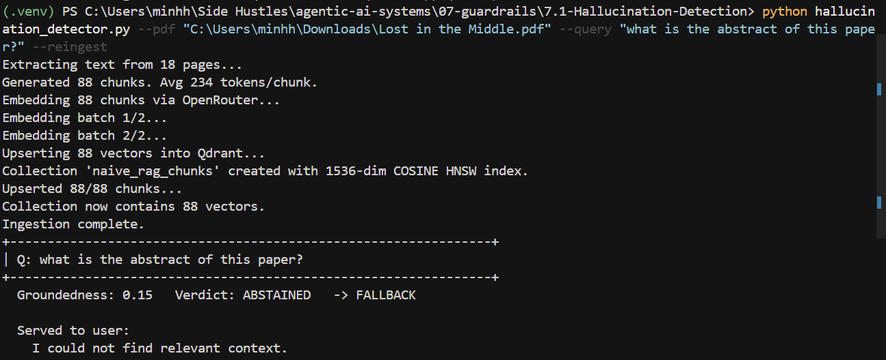
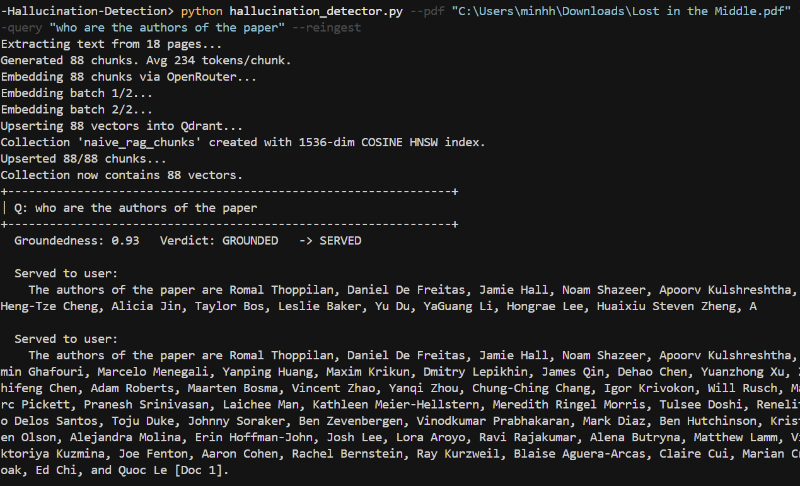

# 7.1 — Hallucination Detection (Day 10)

A **runtime output guardrail** that wraps *any* RAG answer, scores how well it is
grounded in the retrieved context (0–1), diagnoses *which* failure mode is
active, and **refuses** with a fallback when the answer cannot be trusted.

```
question + answer + retrieved chunks
            │
            ▼
   ┌─────────────────────────────────────────────┐
   │  hallucination detector  (detect())          │
   │                                               │
   │  Check 1  retrieved?  did the answer USE the  │   string overlap
   │                       chunks?                 │   (difflib + tokens)
   │  Check 2  cited?      are [Doc N] real IDs?   │   set comparison
   │  Check 3  faithful?   score ≥ 0.5 ?           │   threshold gate
   │                                               │
   │     score = 0.60·support                      │
   │           + 0.25·citation_validity            │
   │           + 0.15·retrieval_adequacy           │
   │     then hard override-gates                  │
   └─────────────────────────────────────────────┘
            │
            ▼
   GroundednessReport { score, verdict, served_answer }
            │
       served? ── yes ──▶ the answer
            │
            no ─────────▶ "I could not find relevant context."
```

Everything runs **offline and deterministically by default** — the test suite
and the demo need no API key, no network, and no Qdrant. An optional OpenRouter
LLM judge (`USE_LLM=1`) can replace the string-overlap support signal.

---

## Results



## Quickstart

```bash
cd 07-guardrails/7.1-Hallucination-Detection
python -m venv .venv && . .venv/Scripts/activate      # Windows
pip install -r requirements.txt

# Prove the Day-10 goal: 5 absent-context questions all fall back.
python hallucination_detector.py --demo            # exit 0 iff goal met

# Score an ad-hoc (question, answer, chunks) triple, with diagnostics.
python hallucination_detector.py --debug `
    --question "What is the capital of Australia?" `
    --answer "The capital of Australia is Canberra [Doc 1]." `
    --chunk "Apollo 11 launched on July 16, 1969." `
    --chunk "Neil Armstrong walked on the Moon in 1969."

# Wrap the Day-4 naive RAG over a real PDF (live mode - see prerequisites below).
python hallucination_detector.py --pdf paper.pdf --query "what is X?" --reingest

# Run the machine-checked suite.
python -m pytest -v
```

> **Live `--pdf` mode prerequisites.** This path ingests the PDF and runs the
> real Day-4 pipeline, so it additionally needs: (1) a running Qdrant
> (`docker run -d -p 6333:6333 qdrant/qdrant`), (2) `OPENROUTER_API_KEY` set,
> and (3) the naive-RAG project's own dependencies:
> `pip install -r ../../03-rag/3.2-NaiveRAG/requirements.txt` (adds `pymupdf`,
> `tiktoken`). The bridge imports the sibling `src` package in an isolated
> namespace window so the two projects' identically-named `src` packages do not
> collide. Missing any prerequisite yields an actionable error, not a traceback.
> The `--demo`, ad-hoc, and test paths need none of this.
>
> **If ingestion hangs at `Extracting text from N pages...`**, it is `tiktoken`
> downloading its `cl100k_base` vocab on first use. Either pre-cache it once
> (`python -c "import tiktoken; tiktoken.get_encoding('cl100k_base')"`) or set
> `FAST_TOKENIZE=1` to skip tiktoken and use a fast `len//4` token estimate
> (only nudges chunk boundaries, never affects the answer or the score).

---

## The five concepts (what to *understand*)

### How to diagnose WHICH failure mode is active
A single "is it a hallucination?" boolean hides the cause. The detector emits a
**`Verdict`** instead, resolved by a fixed precedence so the most serious signal
wins:

`NO_RETRIEVAL` › `FABRICATED_CITATION` › `ABSTAINED` › `UNSUPPORTED` › `UNCITED` › `GROUNDED`

| Verdict | Meaning | Served? |
|---|---|---|
| `NO_RETRIEVAL` | Nothing was retrieved — context absent. | no |
| `FABRICATED_CITATION` | Cites a `[Doc N]` that does not exist. | no |
| `ABSTAINED` | The RAG correctly refused — not a hallucination. | no (fallback) |
| `UNSUPPORTED` | Claims are not present in the chunks. | no |
| `UNCITED` | Supported by the chunks, but no inline citations. | yes, with warning |
| `GROUNDED` | Claims trace to chunks, citations valid. | yes |

### Why a low retrieval score ≠ a bad answer
Retrieval score is `query ↔ chunk` cosine similarity. An answer faithfully
extracted from a single *low-scoring* chunk is still grounded — see
`test_low_retrieval_score_does_not_imply_bad_answer`. Retrieval adequacy is
therefore weighted lowest (0.15) in the score.

### Why a high retrieval score ≠ a good answer
A perfect `query ↔ chunk` match says nothing about whether the *generated
answer* used those chunks. A confident hallucination over a high-scoring chunk
is still `UNSUPPORTED` — see `test_high_retrieval_score_does_not_imply_good_answer`.
Grounding is measured against chunk **text**, never against the retrieval score.

### The 3-check pattern: retrieved? cited? faithful?
- **retrieved?** (`check_support`) — split the answer into claims; for each, take
  the best `max(token-containment, difflib contiguous-span)` over all chunks.
  Containment (not Jaccard) so a short true claim inside a long chunk scores ~1;
  difflib so verbatim extraction is rewarded over coincidental word overlap.
- **cited?** (`check_citations`) — extract `[Doc N]`, compare to the real chunk-id
  space. A label outside it (`[Doc 9]` when 3 chunks exist) is *fabricated*.
- **faithful?** (`compose` + threshold) — blend the signals and refuse below 0.5.

### What a "groundedness score" actually measures
**Answer ↔ evidence entailment**: *can every claim be traced to the retrieved
text?* It is **not** correctness (a true claim absent from the context is still
`UNSUPPORTED` — `test_groundedness_measures_evidence_not_world_correctness`) and
**not** retrieval relevance. It is exactly the axis that catches hallucination.

---

## Scoring policy (one auditable place: `DetectorConfig`)

```
raw = 0.60·mean_support + 0.25·citation_validity + 0.15·retrieval_adequacy
```

Then **hard override gates** can cap the score below the threshold and assign a
verdict — capping (not trusting the blend) is what *guarantees* a fabricated or
unsupported answer can never be served:

| Gate (in order) | Effect |
|---|---|
| 0 chunks retrieved | score → `0.0`, `NO_RETRIEVAL` |
| fabricated citation present | score capped `< threshold`, `FABRICATED_CITATION` |
| answer is a refusal phrase | `ABSTAINED` (serve fallback) |
| `supported_ratio < 0.5` | score capped `< threshold`, `UNSUPPORTED` |

All weights, thresholds, the LLM toggle, and the model are overridable via env
vars (see `.env.example`) or CLI flags (`--threshold`, `--use-llm`).

---

## Architecture

| File | Responsibility | Deps |
|------|----------------|------|
| `hallucination_detector.py` | CLI + rendering (`--demo` / ad-hoc / live `--pdf`) | dotenv |
| `src/detector.py` | `detect()` — run the checks, then assess | — |
| `src/checks.py` | the three checks (pure) | numpy, difflib |
| `src/scoring.py` | composition, override-gates, verdict precedence (pure) | — |
| `src/text.py` | normalisation, sentence split, content tokenisation (pure) | — |
| `src/types.py` | frozen dataclasses + `DetectorConfig` | — |
| `src/llm_judge.py` | optional OpenRouter NLI faithfulness judge (lazy) | openai |
| `src/rag_adapter.py` | naive-RAG bridge: map chunks, run live RAG (lazy) | qdrant-client |
| `src/demo_corpus.py` | the 5 absent-context scenarios + grounded control | — |

The core (`checks`, `scoring`, `text`, `types`) imports nothing networked. The
LLM judge and the live RAG bridge import their heavy deps **lazily**, so the
default path and the entire test suite run with only `numpy` installed.

---

## Goal → evidence

| Goal / task | Where it lives | Proof |
|---|---|---|
| `hallucination_detector.py` wraps any RAG, returns score + verdict | `detect()`, `GroundednessReport` | `test_scoring.py::TestInvariants` |
| Check 1 — answer used chunks? (string overlap / LLM judge) | `check_support`, `llm_judge.llm_support` | `test_checks.py::TestSupport` |
| Check 2 — citations are real chunk IDs? | `check_citations` | `test_checks.py::TestCitations` |
| Check 3 — refuse if confidence < 0.5 | `scoring.assess` + threshold | `test_scoring.py::TestInvariants` |
| Output: answer + groundedness score 0–1 | `GroundednessReport.score/served_answer` | `test_*` (score in `[0,1]`) |
| Fallback: "I could not find relevant context" | `FALLBACK_MESSAGE` | `test_absent_context.py` |
| 5 absent-context questions → all trigger fallback | `demo_corpus.ABSENT_CONTEXT_SCENARIOS` | `test_all_five_absent_scenarios_fall_back` |
| Diagnose which failure mode | `Verdict` + precedence | `test_five_scenarios_cover_four_distinct_failure_modes` |

---

## Key decisions & tradeoffs

- **Guardrail, not benchmark.** This refuses at runtime (lives in `07-guardrails`);
  RAGAS-style offline scoring across a dataset is the job of `08-evaluation`.
- **Containment over Jaccard** for the lexical signal, so chunk length does not
  punish a short, fully-supported claim.
- **difflib *and* token overlap**, combined by `max`, so both verbatim extraction
  and paraphrased reuse register, and both are surfaced in `--debug` diagnostics.
- **Override gates cap the score** rather than relying on the weighted blend —
  the only way to *guarantee* a fabricated/unsupported answer is never served.
- **Abstention is a success, not a failure.** A RAG that correctly says "I don't
  know" is `ABSTAINED`, never mislabelled a hallucination.
- **stdlib dataclasses, not pydantic** — inputs are constructed by an adapter, not
  parsed from an untrusted boundary, so coercion buys little and zero extra deps
  buys a lot. (pydantic is the right call in `07`'s schema-validation artifacts.)

## References

- Es, S., et al. (2023). *RAGAS: Automated Evaluation of Retrieval Augmented
  Generation*. arXiv:2309.15217. https://arxiv.org/abs/2309.15217
- Min, S., et al. (2023). *FActScore: Fine-grained Atomic Evaluation of Factual
  Precision*. arXiv:2305.14251. https://arxiv.org/abs/2305.14251
- Manakul, P., et al. (2023). *SelfCheckGPT*. arXiv:2303.08896.
  https://arxiv.org/abs/2303.08896
- OWASP Top 10 for LLM Applications (LLM09: Misinformation).
  https://owasp.org/www-project-top-10-for-large-language-model-applications/
